

  

<h1 style="text-align: center;">JOBSHEET 10 - RESTFUL API</h1>

Nama: Achmad Maulana Hamzah

NIM: 2341720172

Kelas: TI 2A

# Praktikum 1 – Membuat RESTful API Register
1. Sebelum memulai membuat REST API, terlebih dahulu download aplikasi Postman di
https://www.postman.com/downloads.

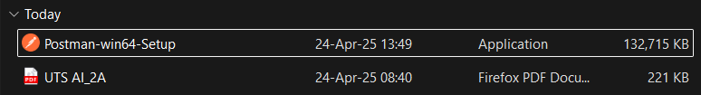

Aplikasi ini akan digunakan untuk mengerjakan semua tahap praktikum pada Jobsheet
ini.
2. Lakukan instalasi JWT dengan mengetikkan perintah berikut:
composer require tymon/jwt-auth:2.1.1
Pastikan Anda terkoneksi dengan internet.

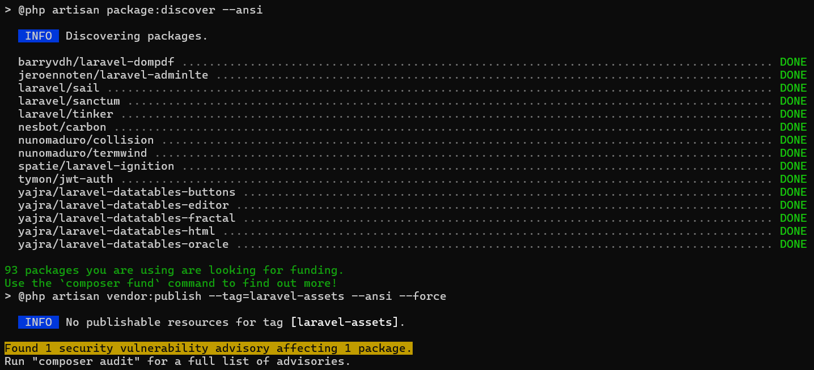

3. Setelah berhasil menginstall JWT, lanjutkan dengan publish konfigurasi file dengan
perintah berikut:
php artisan vendor:publish --
provider="Tymon\JWTAuth\Providers\LaravelServiceProvider"

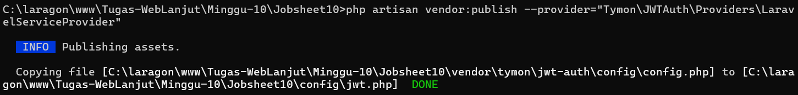

4. Jika perintah di atas berhasil, maka kita akan mendapatkan 1 file baru yaitu
config/jwt.php. Pada file ini dapat dilakukan konfigurasi jika memang diperlukan.

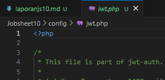

5. Setelah itu jalankan peintah berikut untuk membuat secret key JWT.
php artisan jwt:secret
Jika berhasil, maka pada file .env akan ditambahkan sebuah baris berisi nilai key
JWT_SECRET.

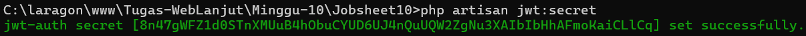

6. Selanjutnya lakukan konfigurasi guard API. Buka config/auth.php. Ubah bagian
‘guards’ menjadi seperti berikut.

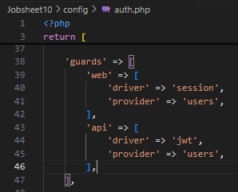

7. Kita akan menambahkan kode di model UserModel, ubah kode seperti berikut:

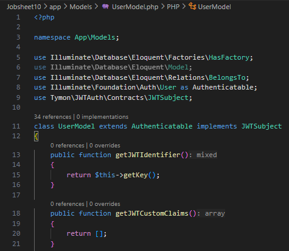

8. Berikutnya kita akan membuat controller untuk register dengan menjalankan peintah
berikut.
php artisan make:controller Api/RegisterController
Jika berhasil maka akan ada tambahan controller pada folder Api dengan nama
RegisterController.

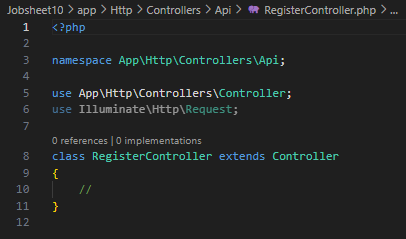

9. Buka file tersebut, dan ubah kode menjadi seperti berikut.

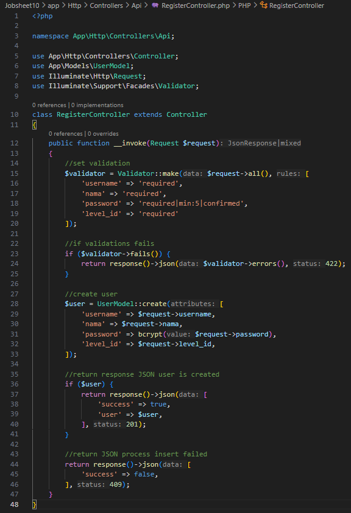

10. Selanjutnya buka routes/api.php, ubah semua kode menjadi seperti berikut.

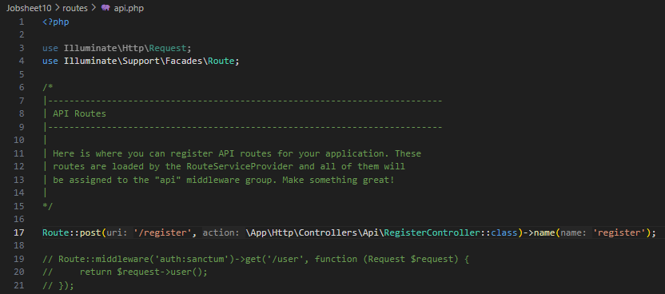

11. Jika sudah, kita akan melakukan uji coba REST API melalui aplikasi Postman.
Buka aplikasi Postman, isi URL localhost/PWL_POS/public/api/register serta method
POST. Klik Send.

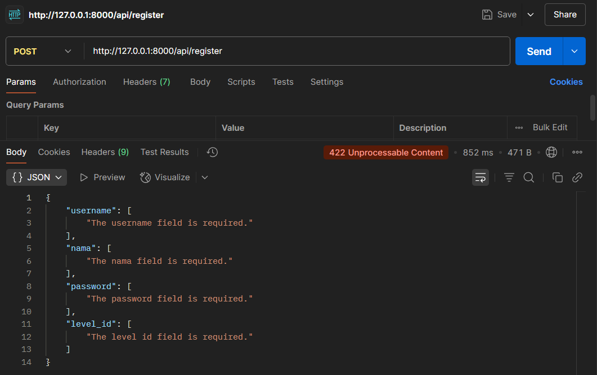

12. Jika berhasil akan muncul error validasi seperti gambar di atas.
Lakukan percobaan yang sama dan berikan screenshoot hasil percobaan Anda.
Setelah klik tombol Send, jika berhasil maka akan keluar pesan sukses seperti gambar
di atas.

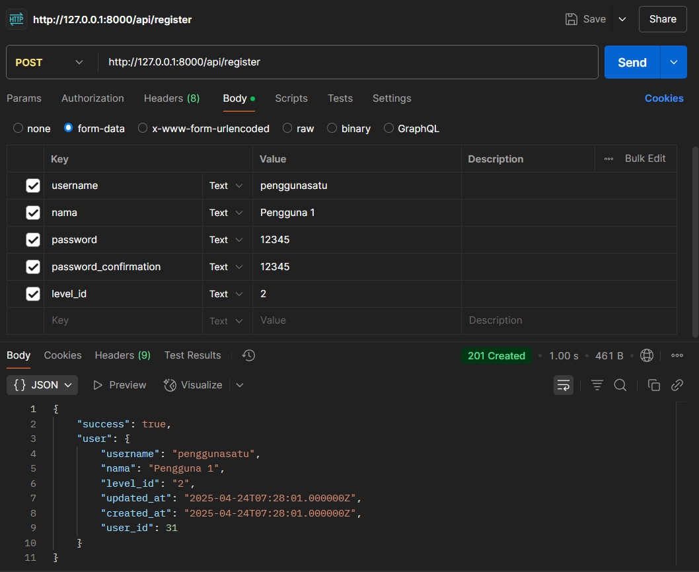

Lakukan percobaan yang sama dan berikan screenshoot hasil percobaan Anda.
13. Lakukan commit perubahan file pada Github.