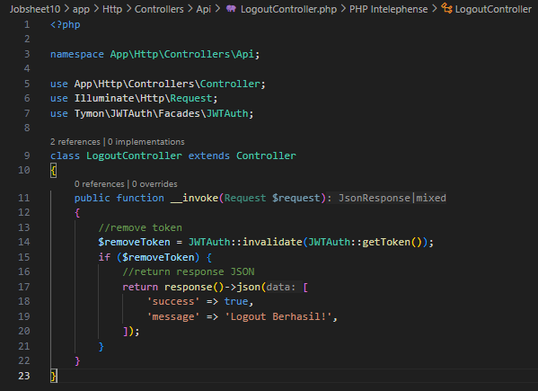
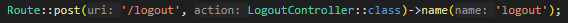

  

<h1 style="text-align: center;">JOBSHEET 10 - RESTFUL API</h1>

Nama: Achmad Maulana Hamzah

NIM: 2341720172

Kelas: TI 2A

# Praktikum 1 – Membuat RESTful API Register
1. Sebelum memulai membuat REST API, terlebih dahulu download aplikasi Postman di
https://www.postman.com/downloads.

Aplikasi ini akan digunakan untuk mengerjakan semua tahap praktikum pada Jobsheet
ini.
2. Lakukan instalasi JWT dengan mengetikkan perintah berikut:
composer require tymon/jwt-auth:2.1.1
Pastikan Anda terkoneksi dengan internet.

3. Setelah berhasil menginstall JWT, lanjutkan dengan publish konfigurasi file dengan
perintah berikut:
php artisan vendor:publish --
provider="Tymon\JWTAuth\Providers\LaravelServiceProvider"

4. Jika perintah di atas berhasil, maka kita akan mendapatkan 1 file baru yaitu
config/jwt.php. Pada file ini dapat dilakukan konfigurasi jika memang diperlukan.

5. Setelah itu jalankan peintah berikut untuk membuat secret key JWT.
php artisan jwt:secret
Jika berhasil, maka pada file .env akan ditambahkan sebuah baris berisi nilai key
JWT_SECRET.

6. Selanjutnya lakukan konfigurasi guard API. Buka config/auth.php. Ubah bagian
‘guards’ menjadi seperti berikut.

7. Kita akan menambahkan kode di model UserModel, ubah kode seperti berikut:

8. Berikutnya kita akan membuat controller untuk register dengan menjalankan peintah
berikut.
php artisan make:controller Api/RegisterController
Jika berhasil maka akan ada tambahan controller pada folder Api dengan nama
RegisterController.

9. Buka file tersebut, dan ubah kode menjadi seperti berikut.

10. Selanjutnya buka routes/api.php, ubah semua kode menjadi seperti berikut.

11. Jika sudah, kita akan melakukan uji coba REST API melalui aplikasi Postman.
Buka aplikasi Postman, isi URL localhost/PWL_POS/public/api/register serta method
POST. Klik Send.

12. Jika berhasil akan muncul error validasi seperti gambar di atas.
Lakukan percobaan yang sama dan berikan screenshoot hasil percobaan Anda.
Setelah klik tombol Send, jika berhasil maka akan keluar pesan sukses seperti gambar
di atas.

Lakukan percobaan yang sama dan berikan screenshoot hasil percobaan Anda.
13. Lakukan commit perubahan file pada Github.

# Praktikum 2 – Membuat RESTful API Login
1. Kita buat file controller dengan nama LoginController.
php artisan make:controller Api/LoginController
Jika berhasil maka akan ada tambahan controller pada folder Api dengan nama
LoginController.

2. Buka file tersebut, dan ubah kode menjadi seperti berikut.

3. Berikutnya tambahkan route baru pada file api.php yaitu /login dan /user.

4. Jika sudah, kita akan melakukan uji coba REST API melalui aplikasi Postman. Buka
aplikasi Postman, isi URL localhost/PWL_POS/public/api/login serta method POST.
Klik Send.
Jika berhasil akan muncul error validasi seperti gambar di atas.
Lakukan percobaan yang sama dan berikan screenshoot hasil percobaan Anda

5. Selanjutnya, isikan username dan password sesuai dengan data user yang ada pada
database. Klik tab Body dan pilih form-data. Isikan key sesuai dengan kolom data, serta
isikan data user. Klik tombol Send, jika berhasil maka akan keluar tampilan seperti
berikut. Copy nilai token yang diperoleh pada saat login karena akan diperlukan pada
saat logout.
Lakukan percobaan yang sama dan berikan screenshoot hasil percobaan Anda.

6. Lakukan percobaan yang untuk data yang salah dan berikan screenshoot hasil percobaan
Anda.

7. Coba kembali melakukan login dengan data yang benar. Sekarang mari kita coba
menampilkan data user yang sedang login menggunakan URL
localhost/PWL_POS/public/api/user dan method GET. Jelaskan hasil dari percobaan
tersebut.

8. Lakukan commit perubahan file pada Github.

# Praktikum 3 – Membuat RESTful API Logout
1. Tambahkan kode berikut pada file .env
JWT_SHOW_BLACKLIST_EXCEPTION=true

2. Buat Controller baru dengan nama LogoutController.
php artisan make:controller Api/LogoutController

3. Buka file tersebut dan ubah kode menjadi seperti berikut.

4. Lalu kita tambahkan routes pada api.php

5. Jika sudah, kita akan melakukan uji coba REST API melalui aplikasi Postman. Buka
aplikasi Postman, isi URL localhost/PWL_POS/public/api/logout serta method POST.
6. Isi token pada tab Authorization, pilih Type yaitu Bearer Token. Isikan token yang
didapat saat login. Jika sudah klik Send.
Lakukan percobaan yang sama dan berikan screenshoot hasil percobaan Anda.

7. Lakukan commit perubahan file pada Github.

# Praktikum 4 – Implementasi CRUD dalam RESTful API
1. Pertama, buat controller untuk mengolah API pada data level.
php artisan make:controller Api/LevelController

2. Setelah berhasil, buka file tersebut dan tuliskan kode seperti berikut yang berisi fungsi
CRUDnya.

3. Kemudian kita lengkapi routes pada api.php.

4. Jika sudah. Lakukan uji coba API mulai dari fungsi untuk menampilkan data. Gunakan
URL: localhost/PWL_POS-main/public/api/levels dan method GET. Jelaskan dan
berikan screenshoot hasil percobaan Anda.

Membuat request get pada api/levels dan menampilkan isi dari responnya

5. Kemudian, lakukan percobaan penambahan data dengan URL : localhost/PWL_POS-
main/public/api/levels dan method POST seperti di bawah ini.
Jelaskan dan berikan screenshoot hasil percobaan Anda.

Membuat request post pada api/levels dengan is body form data level_kode: SPV dan 
level_nama: Supervisor serta respon dari request tersebut

6. Berikutnya lakukan percobaan menampilkan detail data. Jelaskan dan berikan
screenshoot hasil percobaan Anda.

Membuat request pada api/levels/{id} untuk melihat detail data pada id yang 
diberikan

7. Jika sudah, kita coba untuk melakukan edit data menggunakan localhost/PWL_POS-
main/public/api/levels/{id} dan method PUT. Isikan data yang ingin diubah pada tab
Param.
Jelaskan dan berikan screenshoot hasil percobaan Anda.

Membuat request put pada api/levels/{id} untuk mengedit sebuah data dengan 
parameter level_kode untuk data barunya dan menampilkan respons dengan hasil data 
yang baru

8. Terakhir lakukan percobaan hapus data. Jelaskan dan berikan screenshoot hasil
percobaan Anda.

Membuat request delete pada api/levels/{id} dengan responsnya

9. Lakukan commit perubahan file pada Github.

# TUGAS
Implementasikan CRUD API pada tabel lainnya yaitu tabel m_user, m_kategori, dan m_barang

1. m_user

2. m_kategori

3. m_barang

