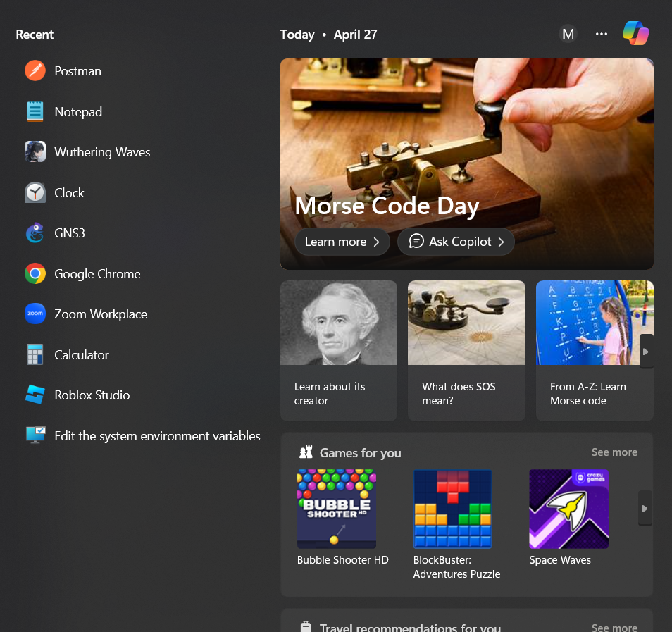
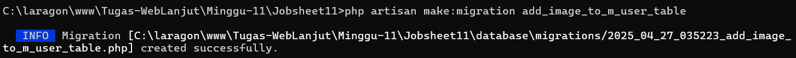
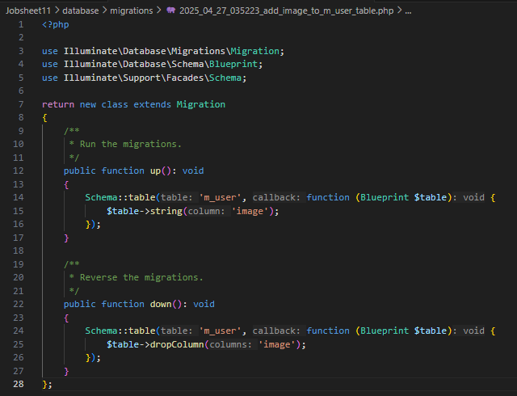
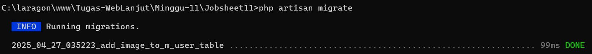
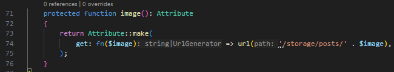
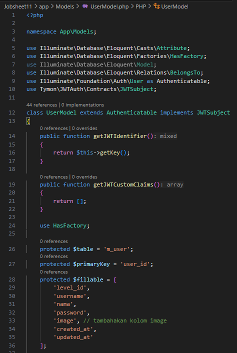
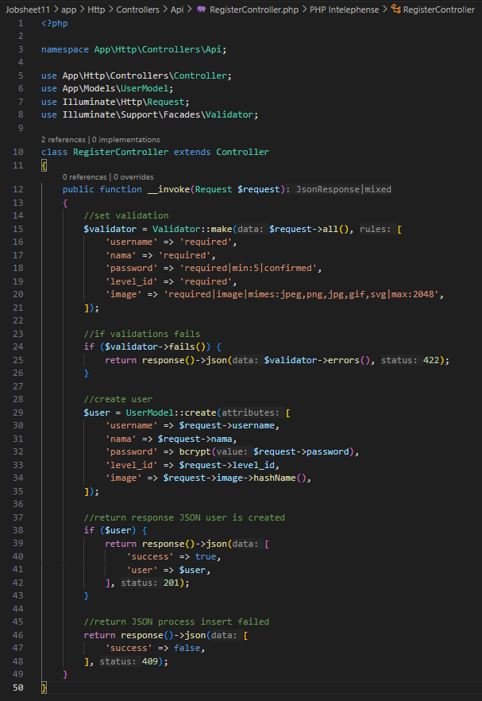
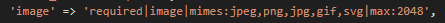
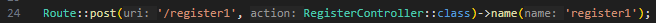
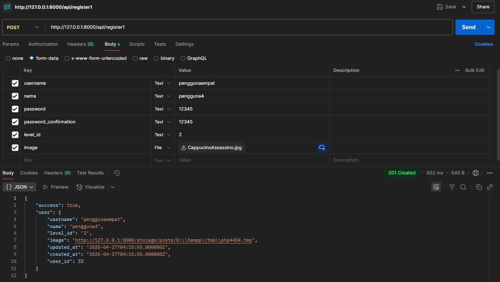

  

<h1 style="text-align: center;">JOBSHEET 10 - RESTFUL API</h1>

Nama: Achmad Maulana Hamzah

NIM: 2341720172

Kelas: TI 2A

# Praktikum 1 – Implementasi Eloquent Accessor
1. Sebelum memulai pastikan REST API, terlebih dahulu pastikan sudah ter instal aplikasi
Postman.

2. Kita akan memodifikasi Table m_user dengan menambahkan column : image, buka
terminal lalu ketikkan
php artisan make:migration add_image_to_m_user_table

3. Buka file migrasi tersebut lalu modifikasi seperti ini lalu simpan:

4. Lakukan jalankan update migrasi dengan cara:
php artisan migrate

5. Lalu lakukan modifikasi models pada App/Models/UserModel.php

6. Lakukan modifikasi pada Controllers/Api/RegisterController

7. Anda dapat menambahkan detail untuk spesifikasi image pada validator

8. Ubah atau tambahkan register1 pada routes/api.php

9. Simpan dan akses pada aplikasi Postman, atur pada Body isi manual Key dan Valuenya
pada Key image tambahkan value File dan upload gambar
http://127.0.0.1:8000/api/register1 dengan method POST dan klik send

10. Pada Controllers/Api/RegisterController bagian create user ganti dengan
11. Uji coba dan screenshot hasilnya apa perbedaan dari yang sebelumnya