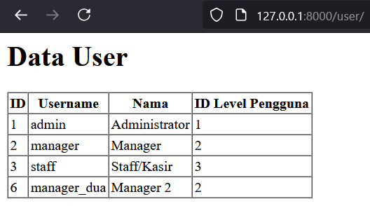
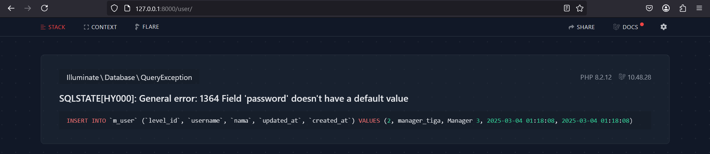
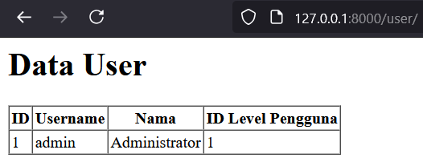
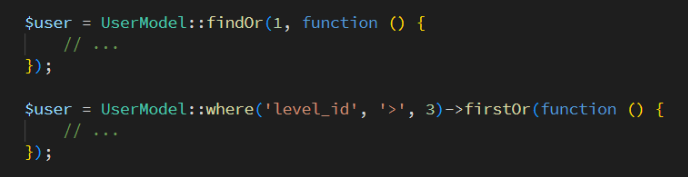
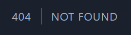

  

<h1 style="text-align: center;">Laporan Jobsheet 4 - MODEL dan ELOQUENT ORM</h1>

Nama: Achmad Maulana Hamzah

NIM: 2341720172

Kelas: TI 2A

### 1. PROPERTI $fillable DAN $guarded
#### Praktikum 1 - $fillable:
1. Buka file model dengan nama UserModel.php dan tambahkan $fillable seperti gambar
di bawah ini
2. Buka file controller dengan nama UserController.php dan ubah script untuk
menambahkan data baru seperti gambar di bawah ini
3. Simpan kode program Langkah 1 dan 2, dan jalankan perintah web server. Kemudian
jalankan link localhostPWL_POS/public/user pada browser dan amati apa yang terjadi

4. Ubah file model UserModel.php seperti pada gambar di bawah ini pada bagian
$fillable
5. Ubah kembali file controller UserController.php seperti pada gambar di bawah hanya
bagian array pada $data
6. Simpan kode program Langkah 4 dan 5. Kemudian jalankan pada browser dan amati
apa yang terjadi

Tidak tampil web karena terjadi kesalahan pada kode, yaitu dihilangkannya 'password' pada fillabel sedangkan pada data di UserController password masih ada.

7. Laporkan hasil Praktikum-1 ini dan commit perubahan pada git.

### 2. RETRIEVING SINGLE MODELS
#### Praktikum 2.1 – Retrieving Single Models
1. Buka file controller dengan nama UserController.php dan ubah script seperti gambar
di bawah ini
2. Buka file view dengan nama user.blade.php dan ubah script seperti gambar di bawah
ini
3. Simpan kode program Langkah 1 dan 2. Kemudian jalankan pada browser dan amati
apa yang terjadi dan beri penjelasan dalam laporan

4. Ubah file controller dengan nama UserController.php dan ubah script seperti gambar
di bawah ini
5. Simpan kode program Langkah 4. Kemudian jalankan pada browser dan amati apa yang
terjadi dan beri penjelasan dalam laporan

6. Ubah file controller dengan nama UserController.php dan ubah script seperti gambar
di bawah ini
7. Simpan kode program Langkah 6. Kemudian jalankan pada browser dan amati apa yang
terjadi dan beri penjelasan dalam laporan

Terkadang Anda mungkin ingin melakukan beberapa tindakan lain jika tidak ada hasil yang
ditemukan. Metode findOr and firstOr akan mengembalikan satu contoh model atau, jika
tidak ada hasil yang ditemukan maka akan menjalankan didalam fungsi. Nilai yang
dikembalikan oleh fungsi akan dianggap sebagai hasil dari metode ini

8. Ubah file controller dengan nama UserController.php dan ubah script seperti gambar
di bawah ini
9. Simpan kode program Langkah 8. Kemudian pada browser dan amati apa yang terjadi
dan beri penjelasan dalam laporan

 

10. Ubah file controller dengan nama UserController.php dan ubah script seperti gambar
di bawah iniSimpan kode program Langkah 10. Kemudian jalankan pada browser dan amati apa
yang terjadi dan beri penjelasan dalam laporan

 

12. Laporkan hasil Praktikum-2.1 ini dan commit perubahan pada git.

