

  

<h1 style="text-align: center;">Laporan Jobsheet 4 - MODEL dan ELOQUENT ORM</h1>

Nama: Achmad Maulana Hamzah

NIM: 2341720172

Kelas: TI 2A

### 1. PROPERTI $fillable DAN $guarded
#### Praktikum 1 - $fillable:
1. Buka file model dengan nama UserModel.php dan tambahkan $fillable seperti gambar
di bawah ini
2. Buka file controller dengan nama UserController.php dan ubah script untuk
menambahkan data baru seperti gambar di bawah ini
3. Simpan kode program Langkah 1 dan 2, dan jalankan perintah web server. Kemudian
jalankan link localhostPWL_POS/public/user pada browser dan amati apa yang terjadi

4. Ubah file model UserModel.php seperti pada gambar di bawah ini pada bagian
$fillable
5. Ubah kembali file controller UserController.php seperti pada gambar di bawah hanya
bagian array pada $data
6. Simpan kode program Langkah 4 dan 5. Kemudian jalankan pada browser dan amati
apa yang terjadi

Tidak tampil web karena terjadi kesalahan pada kode, yaitu dihilangkannya 'password' pada fillabel sedangkan pada data di UserController password masih ada.

7. Laporkan hasil Praktikum-1 ini dan commit perubahan pada git.

### 2. RETRIEVING SINGLE MODELS
#### Praktikum 2.1 – Retrieving Single Models
1. Buka file controller dengan nama UserController.php dan ubah script seperti gambar
di bawah ini
2. Buka file view dengan nama user.blade.php dan ubah script seperti gambar di bawah
ini
3. Simpan kode program Langkah 1 dan 2. Kemudian jalankan pada browser dan amati
apa yang terjadi dan beri penjelasan dalam laporan

4. Ubah file controller dengan nama UserController.php dan ubah script seperti gambar
di bawah ini
5. Simpan kode program Langkah 4. Kemudian jalankan pada browser dan amati apa yang
terjadi dan beri penjelasan dalam laporan

6. Ubah file controller dengan nama UserController.php dan ubah script seperti gambar
di bawah ini
7. Simpan kode program Langkah 6. Kemudian jalankan pada browser dan amati apa yang
terjadi dan beri penjelasan dalam laporan

Terkadang Anda mungkin ingin melakukan beberapa tindakan lain jika tidak ada hasil yang
ditemukan. Metode findOr and firstOr akan mengembalikan satu contoh model atau, jika
tidak ada hasil yang ditemukan maka akan menjalankan didalam fungsi. Nilai yang
dikembalikan oleh fungsi akan dianggap sebagai hasil dari metode ini

8. Ubah file controller dengan nama UserController.php dan ubah script seperti gambar
di bawah ini
9. Simpan kode program Langkah 8. Kemudian pada browser dan amati apa yang terjadi
dan beri penjelasan dalam laporan

 

10. Ubah file controller dengan nama UserController.php dan ubah script seperti gambar
di bawah iniSimpan kode program Langkah 10. Kemudian jalankan pada browser dan amati apa
yang terjadi dan beri penjelasan dalam laporan

 

12. Laporkan hasil Praktikum-2.1 ini dan commit perubahan pada git.

#### Praktikum 2.2 – Not Found Exceptions
1. Ubah file controller dengan nama UserController.php dan ubah script seperti gambar
di bawah ini
2. Simpan kode program Langkah 1. Kemudian jalankan pada browser dan amati apa yang
terjadi dan beri penjelasan dalam laporan

 

3. Ubah file controller dengan nama UserController.php dan ubah script seperti gambar
di bawah ini
4. Simpan kode program Langkah 3. Kemudian jalankan pada browser dan amati apa yang
terjadi dan beri penjelasan dalam laporan

 

5. Laporkan hasil Praktikum-2.2 ini dan commit perubahan pada git.

#### Praktikum 2.3 – Retreiving Aggregrates
1. Ubah file controller dengan nama UserController.php dan ubah script seperti gambar
di bawah ini
2. Simpan kode program Langkah 1. Kemudian jalankan pada browser dan amati apa yang
terjadi dan beri penjelasan dalam laporan

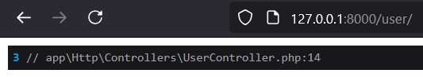 

3. Buat agar jumlah script pada langkah 1 bisa tampil pada halaman browser, sebagai
contoh bisa lihat gambar di bawah ini dan ubah script pada file view supaya bisa muncul
datanya

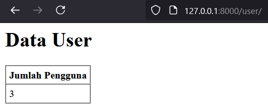

4. Laporkan hasil Praktikum-2.3 ini dan commit perubahan pada git.

#### Praktikum 2.4 – Retreiving or Creating Models
1. Ubah file controller dengan nama UserController.php dan ubah script seperti gambar
di bawah ini
2. Ubah kembali file view dengan nama user.blade.php dan ubah script seperti gambar di
bawah ini
3. Simpan kode program Langkah 1 dan 2. Kemudian jalankan pada browser dan amati
apa yang terjadi dan beri penjelasan dalam laporan

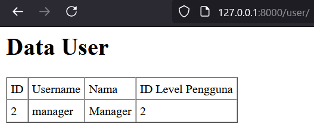

4. Ubah file controller dengan nama UserController.php dan ubah script seperti gambar
di bawah ini
5. Simpan kode program Langkah 4. Kemudian jalankan pada browser dan amati apa yang
terjadi dan cek juga pada phpMyAdmin pada tabel m_user serta beri penjelasan dalam
laporan

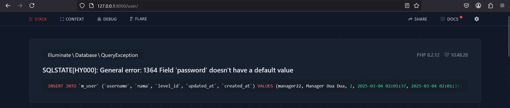

6. Ubah file controller dengan nama UserController.php dan ubah script seperti gambar
di bawah ini
7. Simpan kode program Langkah 6. Kemudian jalankan pada browser dan amati apa yang
terjadi dan beri penjelasan dalam laporan

8. Ubah file controller dengan nama UserController.php dan ubah script seperti gambar
di bawah ini
9. Simpan kode program Langkah 8. Kemudian jalankan pada browser dan amati apa yang
terjadi dan cek juga pada phpMyAdmin pada tabel m_user serta beri penjelasan dalam
laporan

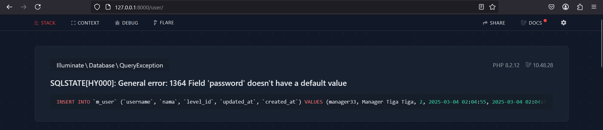

10. Ubah file controller dengan nama UserController.php dan ubah script seperti gambar
di bawah ini
11. Simpan kode program Langkah 9. Kemudian jalankan pada browser dan amati apa yang
terjadi dan cek juga pada phpMyAdmin pada tabel m_user serta beri penjelasan dalam
laporan

12. Laporkan hasil Praktikum-2.4 ini dan commit perubahan pada git.

#### Praktikum 2.5 – Attribute Changes
1. Ubah file controller dengan nama UserController.php dan ubah script seperti gambar
di bawah ini

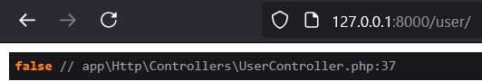

2. Simpan kode program Langkah 1. Kemudian jalankan pada browser dan amati apa yang
terjadi dan beri penjelasan dalam laporan
3. Ubah file controller dengan nama UserController.php dan ubah script seperti gambar
di bawah ini
4. Simpan kode program Langkah 3. Kemudian jalankan pada browser dan amati apa yang
terjadi dan beri penjelasan dalam laporan

5. Laporkan hasil Praktikum-2.5 ini dan commit perubahan pada git.

#### Praktikum 2.6 – Create, Read, Update, Delete (CRUD)
1. Buka file view pada user.blade.php dan buat scritpnya menjadi seperti di bawah ini
2. Buka file controller pada UserController.php dan buat scriptnya untuk read menjadi
seperti di bawah ini
3. Simpan kode program Langkah 1 dan 2. Kemudian jalankan pada browser dan amati
apa yang terjadi dan beri penjelasan dalam laporan

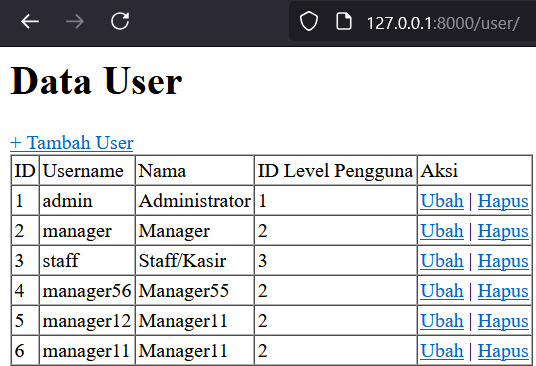

4. Langkah berikutnya membuat create atau tambah data user dengan cara bikin file baru
pada view dengan nama user_tambah.blade.php dan buat scriptnya menjadi seperti di
bawah ini
5. Tambahkan script pada routes dengan nama file web.php. Tambahkan seperti gambar di
bawah ini
6. Tambahkan script pada controller dengan nama file UserController.php. Tambahkan
script dalam class dan buat method baru dengan nama tambah dan diletakan di bawah
method index seperti gambar di bawah ini
7. Simpan kode program Langkah 4 s/d 6. Kemudian jalankan pada browser dan klik link
“+ Tambah User” amati apa yang terjadi dan beri penjelasan dalam laporan

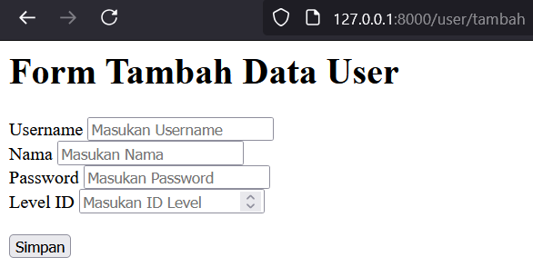

8. Tambahkan script pada routes dengan nama file web.php. Tambahkan seperti gambar di
bawah ini
9. Tambahkan script pada controller dengan nama file UserController.php. Tambahkan
script dalam class dan buat method baru dengan nama tambah_simpan dan diletakan di
bawah method tambah seperti gambar di bawah ini
10. Simpan kode program Langkah 8 dan 9. Kemudian jalankan link
localhost:8000/user/tambah atau localhost/PWL_POS/public/user/tambah pada
browser dan input formnya dan simpan, kemudian amati apa yang terjadi dan beri
penjelasan dalam laporan
11. Langkah berikutnya membuat update atau ubah data user dengan cara bikin file baru
pada view dengan nama user_ubah.blade.php dan buat scriptnya menjadi seperti di
bawah ini
12. Tambahkan script pada routes dengan nama file web.php. Tambahkan seperti gambar di
bawah ini
13. Tambahkan script pada controller dengan nama file UserController.php. Tambahkan
script dalam class dan buat method baru dengan nama ubah dan diletakan di bawah
method tambah_simpan seperti gambar di bawah ini
14. Simpan kode program Langkah 11 sd 13. Kemudian jalankan pada browser dan klik

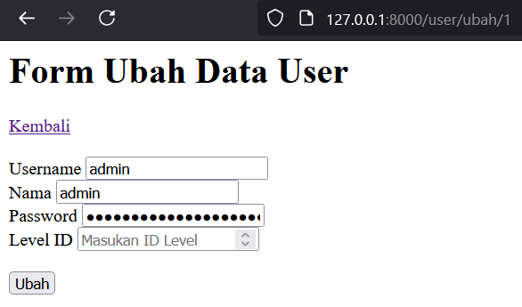

link “Ubah” amati apa yang terjadi dan beri penjelasan dalam laporan
15. Tambahkan script pada routes dengan nama file web.php. Tambahkan seperti gambar di
bawah ini
16. Tambahkan script pada controller dengan nama file UserController.php. Tambahkan
script dalam class dan buat method baru dengan nama ubah_simpan dan diletakan di
bawah method ubah seperti gambar di bawah ini
17. Simpan kode program Langkah 15 dan 16. Kemudian jalankan link
localhost:8000/user/ubah/1 atau localhost/PWL_POS/public/user/ubah/1 pada
browser dan ubah input formnya dan klik tombol ubah, kemudian amati apa yang terjadi
dan beri penjelasan dalam laporan

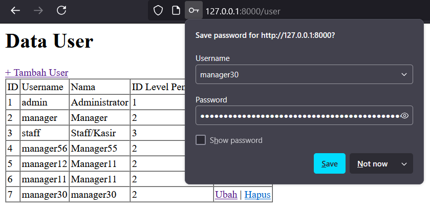

18. Berikut untuk langkah delete . Tambahkan script pada routes dengan nama file web.php.
Tambahkan seperti gambar di bawah ini
19. Tambahkan script pada controller dengan nama file UserController.php. Tambahkan
script dalam class dan buat method baru dengan nama hapus dan diletakan di bawah
method ubah_simpan seperti gambar di bawah ini
20. Simpan kode program Langkah 18 dan 19. Kemudian jalankan pada browser dan klik
tombol hapus, kemudian amati apa yang terjadi dan beri penjelasan dalam laporan
21. Laporkan hasil Praktikum-2.6 ini dan commit perubahan pada git

#### Praktikum 2.7 – Relationships
1. Buka file model pada UserModel.php dan tambahkan scritpnya menjadi seperti di bawah
ini
2. Buka file controller pada UserController.php dan ubah method script menjadi seperti
di bawah ini
3. Simpan kode program Langkah 2. Kemudian jalankan link pada browser, kemudian
amati apa yang terjadi dan beri penjelasan dalam laporan

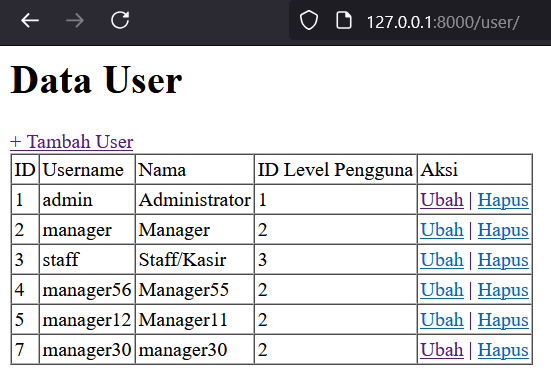

4. Buka file controller pada UserController.php dan ubah method script menjadi seperti
di bawah ini
5. Buka file view pada user.blade.php dan ubah script menjadi seperti di bawah ini
6. Simpan kode program Langkah 4 dan 5. Kemudian jalankan link pada browser,
kemudian amati apa yang terjadi dan beri penjelasan dalam laporan

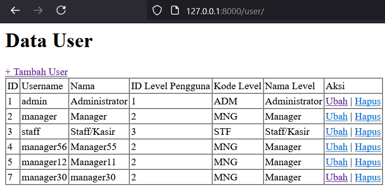

7. Laporkan hasil Praktikum-2.7 ini dan commit perubahan pada git.