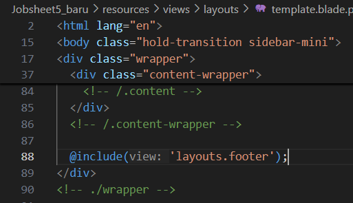

  

<h1 style="text-align: center;">Laporan Jobsheet 5 - Blade View, Web Templating(AdminLTE), Datatables</h1>

Nama: Achmad Maulana Hamzah

NIM: 2341720172

Kelas: TI 2A

# Praktikum 1 - Layouting AdminLTE:
1. Kita download AdminLTE v3.2.0 yang rilis pada 8 Feb 2022
2. Seleteh kita berhasil download, kita ekstrak file yang sudah di download ke folder
project PWL_POS/public, kemudian kita rename folder cukup menjadi adminlte
3. Selanjutnya kita buka di browser dengan alamat
http://localhost/PWL_POS/public/adminlte maka akan muncul tampilan seperti
berikut

4. Kita klik menu Extras > Blank Page, page inilah yang akan menjadi dasar web template

5. Dari sini kita bisa melakukan layouting halaman Blank Page ini menjadi 4 element
seperti pada gambar berikut
6. Selanjutnya kita klik kanan halaman Blank Page dan klik view page source

7. Selanjutnya kita copy page source dari halaman Blank Page, kemudia kita paste pada
PWL_POS/resource/view/layouts/template.blade.php (buat dulu folder layouts dan
file template.blade.php)
8. File layouts/template.blade.php adalah file utama untuk templating website
9. Pada baris 1-14 file template.blade.php, kita modifikasi menjadi

10. Kemudian kita blok baris 19-153 (baris untuk element 1-header), lalu kita cut, dan
paste-kan di file PWL_POS/resource/view/layouts/header.blade.php (buat dulu file
header.blade.php jika belum ada). Sehingga tampilan dari file template.blade.php
menjadi seperti berikut

Baris 19 adalah komponen Blade untuk memanggil elemen layouts/header.blade.php
agar menjadi satu dengan template.blade.php saat di-render nanti.

11. Kita modifikasi baris 25 dan 26 pada template.blade.php menjadi

12. Selanjutnya kita blok baris 31-693 (baris untuk element 2-sidebar), lalu kita cut, dan
paste-kan di file PWL_POS/resource/view/layouts/sidebar.blade.php (buat dulu file
sidebar.blade.php jika belum ada). Sehingga tampilan dari file template.blade.php
menjadi seperti berikut

13. Selanjutnya perhatikan baris 87-98 (baris untuk element 5-footer), lalu kita cut, dan
paste-kan di file PWL_POS/resource/view/layouts/footer.blade.php (buat file
footer.blade.php jika belum ada). Sehingga tampilan dari file template.blade.php
menjadi seperti berikut

14. Kemudian kita modifikasi file template.blade.php baris 91-100
Menjadi

15. Sekarang masuk pada bagian konten. Konten kita bagi menjadi 2, yaitu elemen untuk
breadcrumb dan elemen untuk content.

16. Perhatikan file template.blade.php pada baris 38-52 kita jadikan sebagai elemen 4-
breadcrumb. Kita blok baris 38-52 lalu kita cut, dan paste-kan di file
PWL_POS/resource/view/layouts/breadcrumb.blade.php (buat file
breadcrumb.blade.php jika belum ada). Sehingga tampilan dari file
template.blade.php menjadi seperti berikut
17. Layout terakhir adalah pada bagian konten. Layout untuk konten bisa kita buat dinamis,
sesuai dengan apa yang ingin kita sajikan pada web yang kita bangun.
18. Untuk content, kita akan menghapus baris 42-66 pada file template.blade.php. dan kita
ganti dengan kode seperti ini @yield('content')
19. Hasil akhir pada file utama layouts/template.blade.php adalah seperti berikut

20. Selamat kalian sudah selesai dalam melakukan layouting website di laravel.
21. Jangan lupa commit dan push ke github untuk praktikum 1 ini