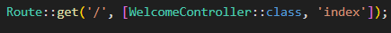

  

<h1 style="text-align: center;">Laporan Jobsheet 5 - Blade View, Web Templating(AdminLTE), Datatables</h1>

Nama: Achmad Maulana Hamzah

NIM: 2341720172

Kelas: TI 2A

# Praktikum 1 - Layouting AdminLTE:
1. Kita download AdminLTE v3.2.0 yang rilis pada 8 Feb 2022
2. Seleteh kita berhasil download, kita ekstrak file yang sudah di download ke folder
project PWL_POS/public, kemudian kita rename folder cukup menjadi adminlte
3. Selanjutnya kita buka di browser dengan alamat
http://localhost/PWL_POS/public/adminlte maka akan muncul tampilan seperti
berikut

4. Kita klik menu Extras > Blank Page, page inilah yang akan menjadi dasar web template

5. Dari sini kita bisa melakukan layouting halaman Blank Page ini menjadi 4 element
seperti pada gambar berikut
6. Selanjutnya kita klik kanan halaman Blank Page dan klik view page source

7. Selanjutnya kita copy page source dari halaman Blank Page, kemudia kita paste pada
PWL_POS/resource/view/layouts/template.blade.php (buat dulu folder layouts dan
file template.blade.php)
8. File layouts/template.blade.php adalah file utama untuk templating website
9. Pada baris 1-14 file template.blade.php, kita modifikasi menjadi

10. Kemudian kita blok baris 19-153 (baris untuk element 1-header), lalu kita cut, dan
paste-kan di file PWL_POS/resource/view/layouts/header.blade.php (buat dulu file
header.blade.php jika belum ada). Sehingga tampilan dari file template.blade.php
menjadi seperti berikut

Baris 19 adalah komponen Blade untuk memanggil elemen layouts/header.blade.php
agar menjadi satu dengan template.blade.php saat di-render nanti.

11. Kita modifikasi baris 25 dan 26 pada template.blade.php menjadi

12. Selanjutnya kita blok baris 31-693 (baris untuk element 2-sidebar), lalu kita cut, dan
paste-kan di file PWL_POS/resource/view/layouts/sidebar.blade.php (buat dulu file
sidebar.blade.php jika belum ada). Sehingga tampilan dari file template.blade.php
menjadi seperti berikut

13. Selanjutnya perhatikan baris 87-98 (baris untuk element 5-footer), lalu kita cut, dan
paste-kan di file PWL_POS/resource/view/layouts/footer.blade.php (buat file
footer.blade.php jika belum ada). Sehingga tampilan dari file template.blade.php
menjadi seperti berikut

14. Kemudian kita modifikasi file template.blade.php baris 91-100
Menjadi

15. Sekarang masuk pada bagian konten. Konten kita bagi menjadi 2, yaitu elemen untuk
breadcrumb dan elemen untuk content.

16. Perhatikan file template.blade.php pada baris 38-52 kita jadikan sebagai elemen 4-
breadcrumb. Kita blok baris 38-52 lalu kita cut, dan paste-kan di file
PWL_POS/resource/view/layouts/breadcrumb.blade.php (buat file
breadcrumb.blade.php jika belum ada). Sehingga tampilan dari file
template.blade.php menjadi seperti berikut
17. Layout terakhir adalah pada bagian konten. Layout untuk konten bisa kita buat dinamis,
sesuai dengan apa yang ingin kita sajikan pada web yang kita bangun.
18. Untuk content, kita akan menghapus baris 42-66 pada file template.blade.php. dan kita
ganti dengan kode seperti ini @yield('content')
19. Hasil akhir pada file utama layouts/template.blade.php adalah seperti berikut

20. Selamat kalian sudah selesai dalam melakukan layouting website di laravel.
21. Jangan lupa commit dan push ke github untuk praktikum 1 ini

# Praktikum 2 - Penerapan Layouting
1. Kita buat file controller dengan nama WelcomeController.php

2. Kita buat file pada PWL_POS/resources/views/welcome.blade.php

3. Kita modifikasi file PWL_POS/resources/views/layouts/breadcrumb.blade.php

4. Kita modifikasi file PWL_POS/resources/views/layouts/sidebar.blade.php
5. Kita tambahkan kode berikut router web.php

6. Sekarang kita coba jalankan di browser dengan mengetikkan url
http://localhost/PWL_POS/public

7. Jangan lupa commit dan push ke github PWL_POS kalian

# Praktikum 3 – Implementasi jQuery Datatable di AdminLTE
1. Kita modifikasi proses CRUD pada tabel m_user pada praktikum ini
2. Kita gunakan library Yajra-datatable dengan mengetikkan perintah pada CMD
composer require yajra/laravel-datatables:^10.0 atau
composer require yajra/laravel-datatables-oracle

3. Kita modifikasi route web.php untuk proses CRUD user

4. Kita buat atau modifikasi penuh untuk UserController.php. Kita buat fungsi index()
untuk menampilkan halaman awal user

5. Lalu kita buat view pada PWL/resources/views/user/index.blade.php

6. Kemudian kita modifikasi file template.blade.php untuk menambahkan library jquery
datatables dari template AdminLTE yang kita download dan berada di folder public

7. Untuk bisa menangkap request data untuk datatable, kita buat fungsi list() pada
UserController.php seperti berikut

8. Sekarang coba jalankan browser, dan klik menu Data User..!!! perhatikan dan amati
apa yang terjadi.

Menampilkan halaman/tabel daftar user

9. Selanjutnya kita modifikasi UserController.php untuk form tambah data user

10. Sekarang kita buat form untuk menambah data, kita buat file
PWL/resources/views/user/create.blade.php

11. Kemudian untuk bisa menng-handle data yang akan disimpan ke database, kita buat
fungsi store() di UserController.php

12. Sekarang coba kalian buka form tambah data user dengan klik tombol tambah. Amati
dan pelajari..!!!

13. Selanjutnya, kita masuk pada bagian menampilkan detail data user (klik tombol "Detail")
pada halaman user. Route yang bertugas untuk menangkap request detail adalah

14. Jadi kita buat/modifikasi fungsi show() pada UserController.php seperti berikut

15. Kemudian kita buat view di PWL/resources/views/user/show.blade.php
16. Sekarang kalian coba untuk melihat detail data user di browser, dan coba untuk
mengetikkan id yang salah contoh http://localhost/PWL/public/user/100 amati apa
yang terjadi, dan laporkan!!!

Menampilkan hasil data yang dicari tidak ditemukan

17. Selanjutnya, kita masuk pada bagian untuk memodifikasi data user. Route yang bertugas
untuk menangkap request edit adalah

18. Jadi kita buat fungsi edit() dan update() pada UserController.php

19. Selanjutnya, kita buat view untuk melakukan proses edit data user di
PWL/resources/views/user/edit.blade.php
20. Sekarang kalian coba untuk mengedit data user di browser, amati, pahami, dan laporkan!

Berhasil mengedit data user

21. Selanjutnya kita akan membuat penanganan untuk tombol hapus. Router web.php yang
berfungsi untuk menangkap request hapus dengan method DETELE adalah
Route::delete('/{id}', [UserController::class, 'destroy']);
22. Jadi kita buat fungsi destroy() pada UserController.php

23. Selanjutnya kita modifikasi file PWL/resources/views/user/index.blade.php untuk
menambahkan tampilan jika ada pesan error
Menjadi
24. Kemudian jalankan browser untuk menghapus salah satu data user. Amati dan laporkan!

25. Selamat, kalian sudah membuat Laravel Starter Code untuk proses CRUD dengan
menggunakan template AdminLTE dan plugin jQuery Datatables.
26. Jangan lupa commit dan push ke github PWL_POS kalian

# Praktikum 4 – Implementasi Filtering Datatables
1. Kita modifikasi fungsi index() di UserController.php untuk menambahkan data yang
ingin dijadikan kategori untuk data filtering

2. Kemudian kita modifikasi view untuk menampilkan data filtering pada
PWL/resources/views/user/index.blade.php
3. Selanjutnya, tetap pada view index.blade.php, kita tambahkan kode berikut pada
deklarasi ajax di datatable. Kode ini digunakan untuk mengirimkan data untuk filtering
4. Kemudian kita edit pada bagian akhir script @push(‘js’) untuk menambahkan listener
jika data filtering dipilih
5. Tahapan akhir adalah memodifikasi fungsi list() pada UserController.php yang
digunakan untuk menampilkan data pada datatable

6. Bagian akhir adalah kita coba jalankan di browser dengan akses menu user, maka akan
tampil seperti berikut

7. Selamat, sekarang Laravel Starter Code sudah ada filtering dan searching data. Starter
Code sudah bisa digunakan dalam membangun sebuah sistem berbasis website.
8. Jangan lupa commit dan push ke github PWL_POS kalian