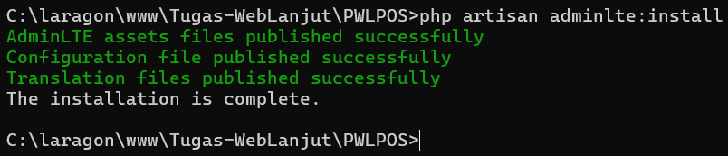
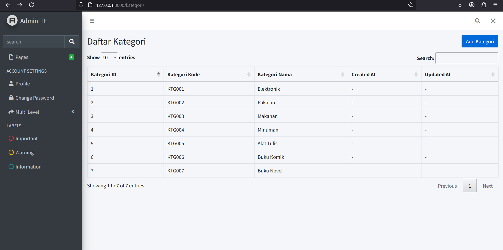

  

<h1 style="text-align: center;">Laporan Jobsheet 5 - Blade View, Web Templating(AdminLTE), Datatables</h1>

Nama: Achmad Maulana Hamzah

NIM: 2341720172

Kelas: TI 2A

# Praktikum 1 – Integrasi Laravel dengan AdminLte3
Cara paling cepat dan clean dapat dilakukan menggunakan repository dalam tautan
berikut https://github.com/jeroennoten/Laravel-AdminLTE/wiki/Installation.

1. Dalam root folder project lakukan command berikut, untuk mendefinisikan requirement project

composer require jeroennoten/laravel-adminlte

2. Melakukan instalasi requirement project di atas dengan command berikut:

php artisan adminlte:install

Perintah di atas akan meng-install:

• AdminLTE distribution files dan dependensinya (Bootstrap, jQuery, etc.) dalam folder public/vendor.

• Konfigurasi package di file config/adminlte.php

• Paket translasi di folder lang/vendor/adminlte/

• Dalam composer.json akan otomatis ditambahkan require untuk laravel-adminlte

3. Buat file resources/views/layout/app.blade.php. Isi dengan kode berikut.
4. Edit resources/views/welcome.blade.php, kemudian replace seluruh kodenya dengan
kode berikut

**NOTE:**
Pada awalnya terjadi kesalahan karena kode @extends('layouts.app'), seharusnya huruf s pada layouts dihilangkan agar sesuai dengan folder yang telah kita buat sebelumnya.

Untuk menggunakan blade template ini cukup dengan extend AdminLTE layout dengan
cara @extends('adminlte::page').
Template yields di beberapa bagian terklasifikasi dalam 2 field:

• main: Biasa digunakan untuk extending the layout.

• misc: untuk kasus yang tidak biasa, atau hanya situasi tertentu.

Dokumentasi lebih detail terdapat di link berikut: https://github.com/jeroennoten/Laravel-AdminLTE/wiki/Usage

5. Kembali ke browser, menuju ke halaman awal.

# Praktikum 2 – Integrasi dengan DataTables

Datatables biasa digunakan untuk menampilkan list data dengan banyak fitur seperti
searching, pagination, sorting dan lain-lainnya. Dalam laravel biasa digunankan yajra datatables
karena didesain agar sesuai dengan laravel.

https://yajrabox.com/docs/laravel-datatables/10.0

Berikut langkah-langkah praktikum:
1. Install Laravel DataTables

composer require laravel/ui --dev

composer require yajra/laravel-datatables:^10.0

**NOTE:**
Perintah composer require laravel/ui --dev tidak diperlukan untuk Praktikum 2 ini karena tidak ada kaitannya dengan DataTables. laravel/ui adalah package yang digunakan untuk scaffolding frontend seperti Bootstrap, Vue, dan React di Laravel. Dalam Praktikum 2, kita hanya perlu menginstal Yajra DataTables (yajra/laravel-datatables), yang tidak bergantung pada laravel/ui.

**NOTE:**
Tambahkan juga service provider ke dalam config/app.php

2. Pastikan nodejs sudah terinstall, dengan perintah npm -v.
Jika belum install nodejs package manager dari https://nodejs.org/dist/v20.11.1/node-v20.11.1-x64.msi

Npm digunakan untuk manajemen package javascript.

3. Install Laravel DataTables Vite dan sass

npm i laravel-datatables-vite --save-dev

npm install -D sass

4. Edit file resources/js/app.js
5. Buatlah file resources/saas/app.scss
6. Jalankan dengan npm run dev

7. Selanjutnya kita akan buat datatables untuk kategori

php artisan datatables:make Kategori

8. Kita edit KategoriDatable untuk mengatur kolom apasaja yang ingin ditampilkan
Sesuaikan dengan kodeprogram berikut
9. Ubah kategori model, sesuaikan seperti berikut

**NOTE:**
Setelah mengubah KategoriModel, akan terjadi error pada fungsi barang(). Oleh karena itu, buat file BarangModel.php didalam folder Models.

10. Ubah Kategori Controller sesuaikan dengan skrip berikut
11. Buat folder kategori di dalam resources/view, kemudian buat view blade index untuk
kategori resources/views/kategori/index.blade.php
12. Pastikan route untung kategori sudah tersedia
13. Sesuaikan app layout seperti kode berikut
14. Menset ViteJs / script type defaults
15. Isikan beberapa data ke table kategori
16. Datatables sudah dapat di load di /kategori

# Praktikum 3 – Membuat form kemudian menyimpan data dalam database
Langkah-langkahnya adalah sebagai berikut:

1. Menyesuaikan routing, tambahkan dua routing berikut
2. Tambahkan dua function berikut dalam KategoriController
3. Dalam folder views/kategori, buatlah file dengan nama create.blade.php
4. Kita lakukan pengecualian proteksi CsrfToken. Karena kita belum melakukan otentikasi. Kita edit dalam file berikut:
5. Akses kategori/create

6. Halaman kategori

# Tugas Praktikum
1. Tambahkan button Add di halam manage kategori, yang mengarah ke create kategori
baru

2. Tambahkan menu untuk halaman manage kategori, di daftar menu navbar
3. Tambahkan action edit di datatables dan buat halaman edit serta controllernya
4. Tambahkan action delete di datatables serta controllernya

