

  

<h1 style="text-align: center;">Laporan Jobsheet 6 - Ajax Form (AdminLTE) dan Client Validation</h1>

Nama: Achmad Maulana Hamzah

NIM: 2341720172

Kelas: TI 2A

# Praktikum 1. Modal Ajax Tambah Data (Data User)
1. Kita buat form tambah data baru dengan menerapkan modal dan proses ajax.
2. Pertama yang kita siapkan adalah menambahkan library jQuery Validation dan
Sweetalert ke aplikasi web kita. Caranya kita tambahkan link kedua library tersebut ke
template.blade.php, library sudah disediakan oleh adminLTE.

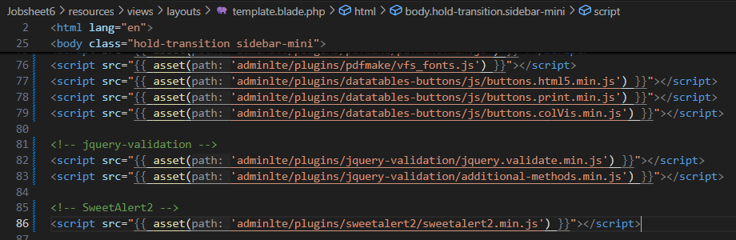

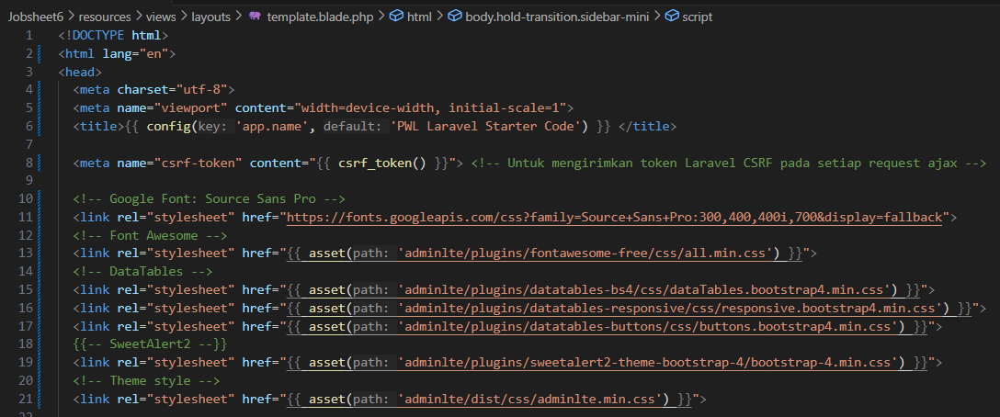

3. Selanjutnya Kita modifikasi view user/index.blade.php, kita tambahkan tombol untuk
membuat form popup ajax.
Kita tambahkan kode berikut, untuk membuat form modal tambah data user dengan ajax

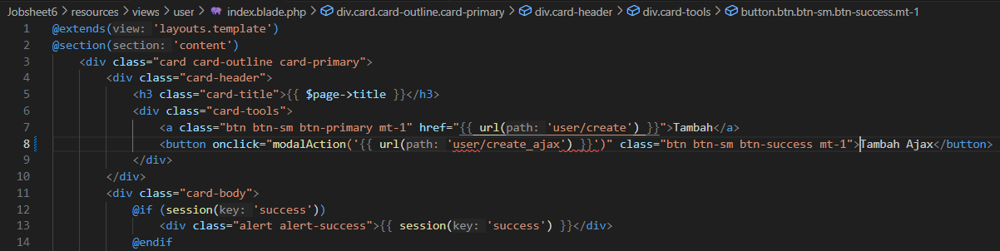

4. Selanjutnya kita tambahkan kode berikut pada akhir @section(‘content’) pada view
user/index.blade.php

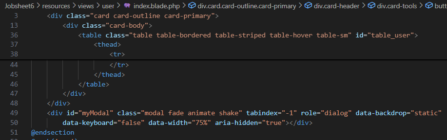

5. Kemudian kita tambahkan kode berikut pada awal @push(‘js’) pada view
user/index.blade.php
Sehingga tampilan kode program akan seperti berikut

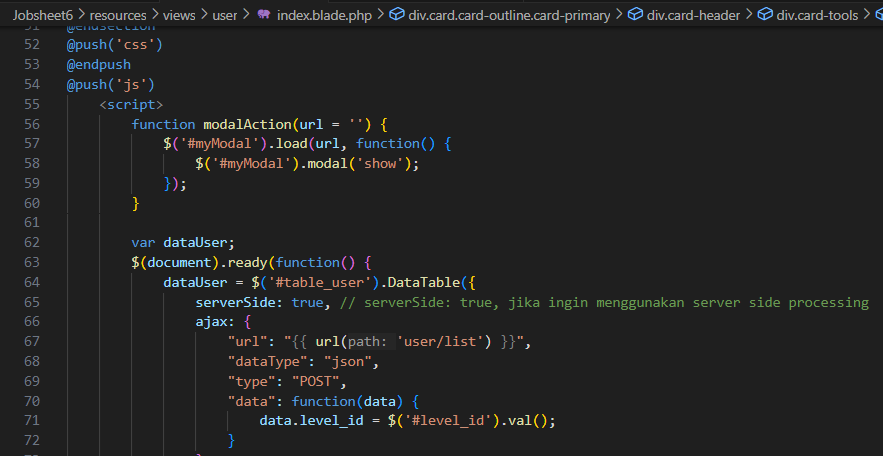

6. Selanjutkan Kita modifikasi route/web.php untuk mengakomodir operasi ajax

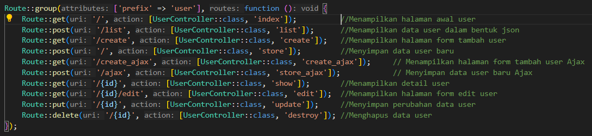

7. Kemudian Kita tambahkan fungsi create_ajax() pada file UserController.php

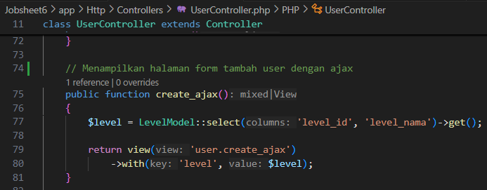

8. Setelah itu, kita buat view baru user/create_ajax.blade.php untuk menampilkan form
dengan ajax

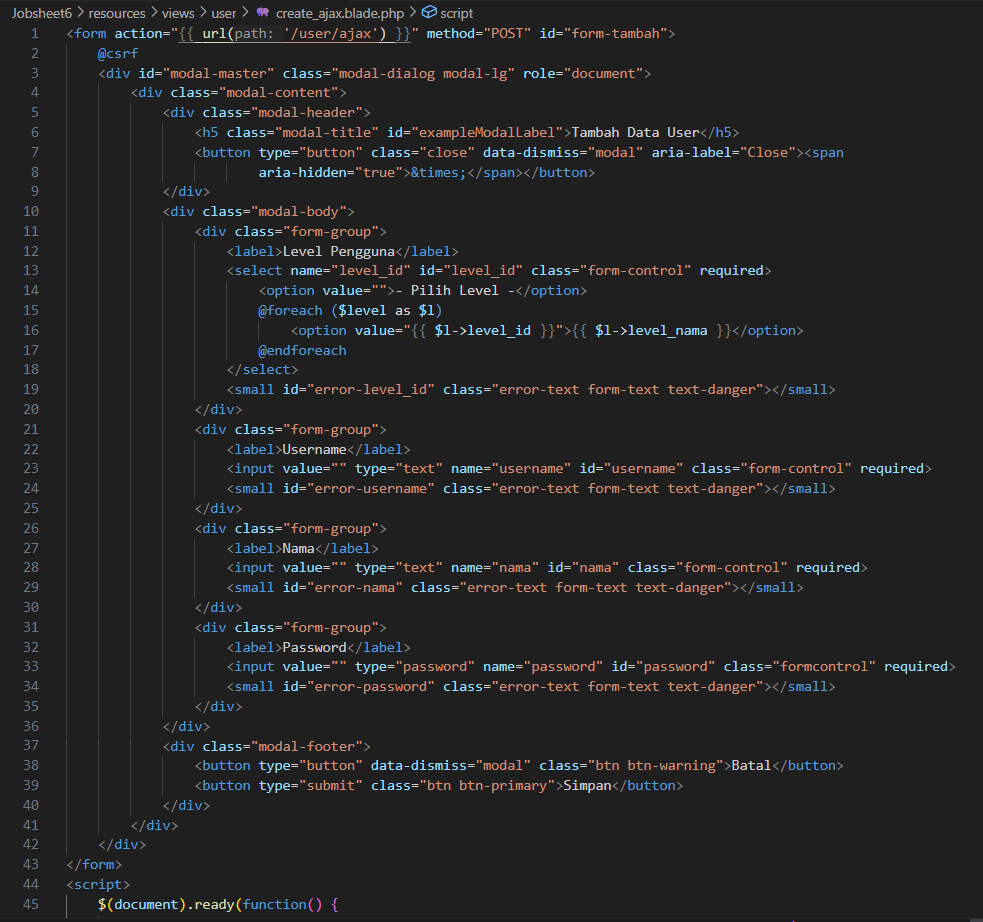

9. Kemudian untuk mengakomodir proses simpan data melalui ajax, kita buat fungsi
store_ajax() pada UserController.php

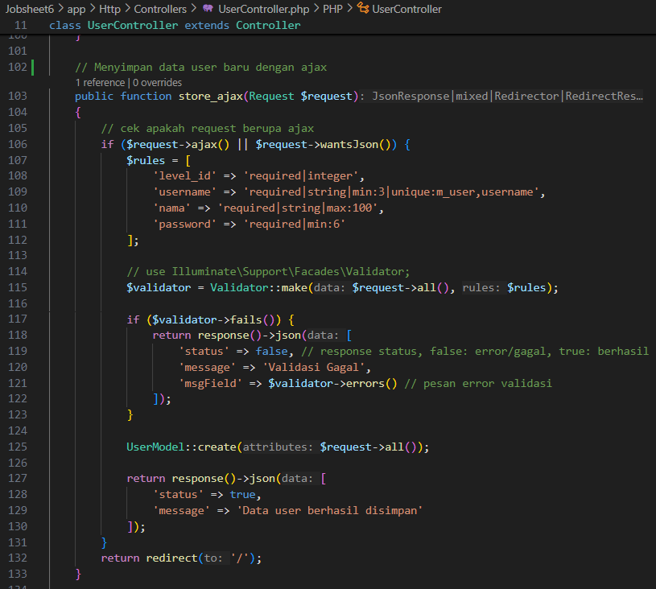

10. OK, sekarang kita coba melakukan proses tambah data user menggunakan form ajax.
Amati apa yang terjadi dan laporankan pada laporan jobsheet dan commit di github
kalian!!!

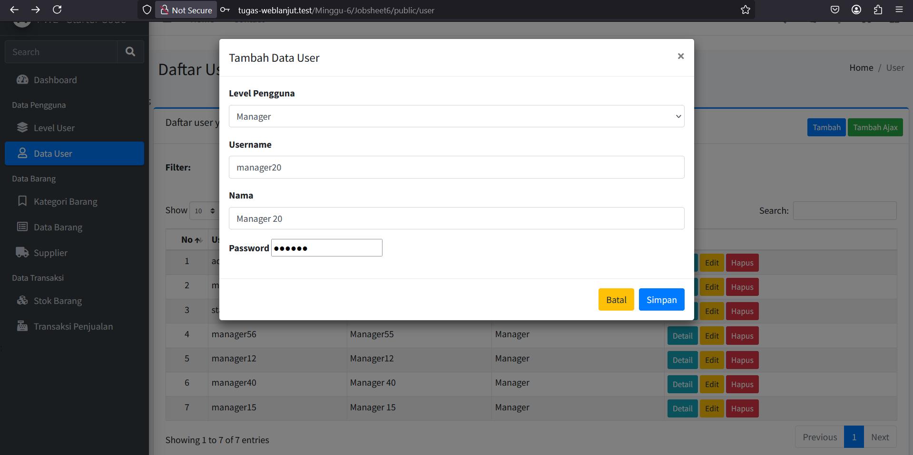

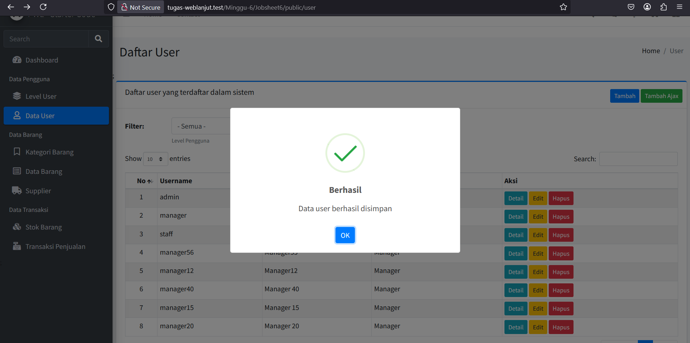

# Praktikum 2. Modal Ajax Edit Data (Data User)
1. Pada Praktikum 2 ini, kita akan melakukan koding untuk proses edit menggunakan ajax.
2. Pertama-tama, kita ubah dulu fungsi list() pada UserController.php untuk mengganti
tombol edit untuk bisa menggunakan modal

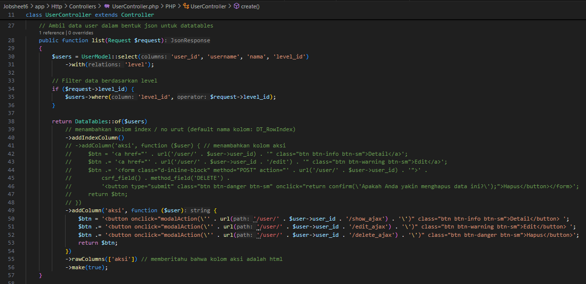

3. Selanjutnya kita modifikasi routes/web.php untuk mengakomodir request edit
menggunakan ajax

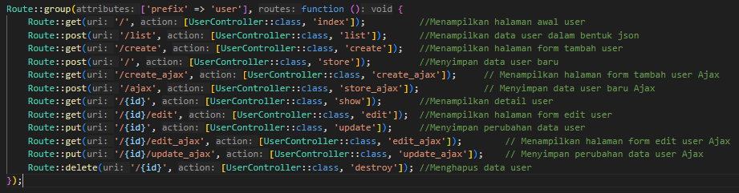

4. Kemudian, kita buat fungsi edit_ajax() pada UserController.php

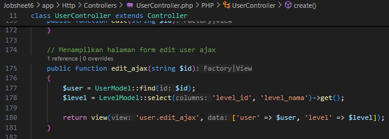

5. Kita buat view baru pada user/edit_ajax.blade.php untuk menampilkan form view
ajax

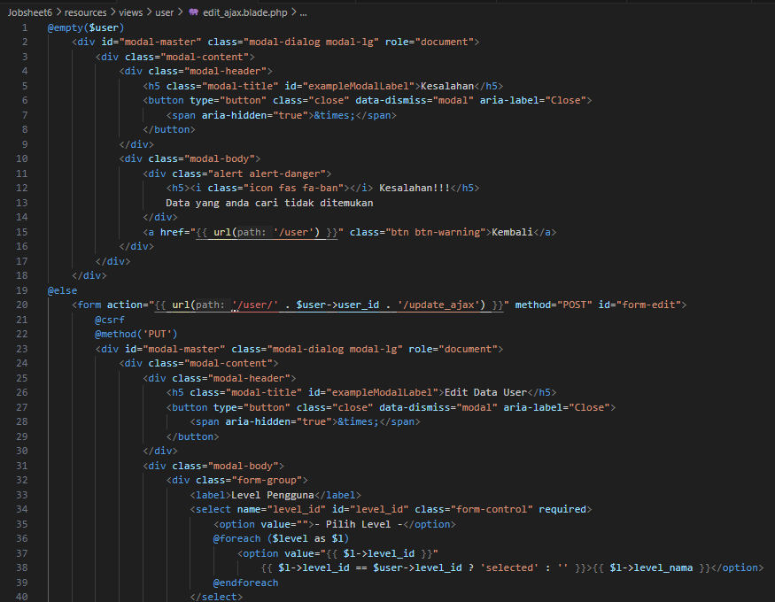

6. Selanjutnya, kita buat fungsi update_ajax() pada UserController.php untuk
mengakomodir request update data user melalui ajax

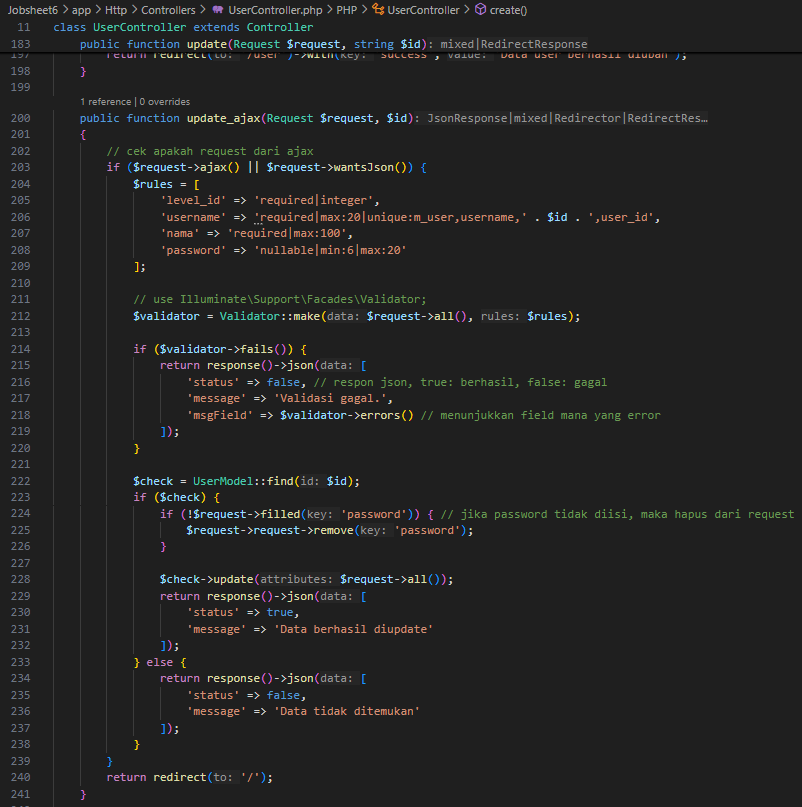

7. Sekarang kita coba bagian edit user, amati proses nya. Jangan lupa laporkan dan commit
ke repository git kalian !

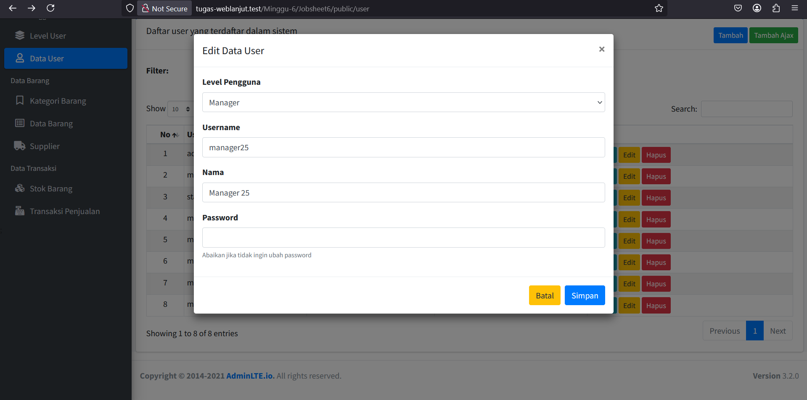

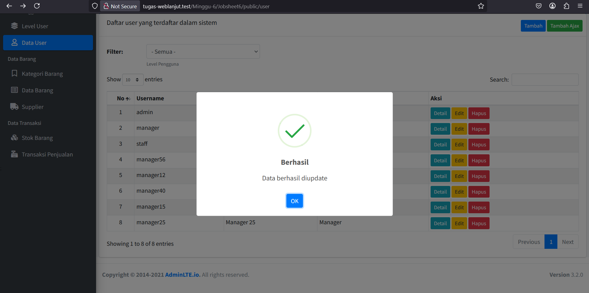

# Praktikum 3. Modal Ajax Hapus Data (Data User)
1. Pada Praktikum 3 ini, kita akan melakukan koding untuk proses hapus menggunakan ajax.
2. Pertama-tama, kita ubah dulu routes/web.php untuk mengakomodir request halaman
konfirmasi untuk menghapus data

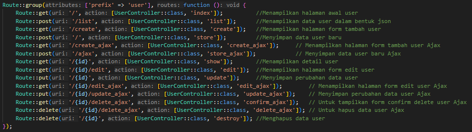

3. Kemudian kita buat fungsi confirm_ajax() pada UserController.php

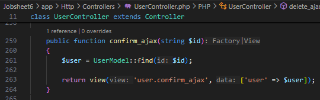

4. Selanjutnya kita view untuk konfirmasi hapus data dengan nama
user/confirm_ajax.blade.php

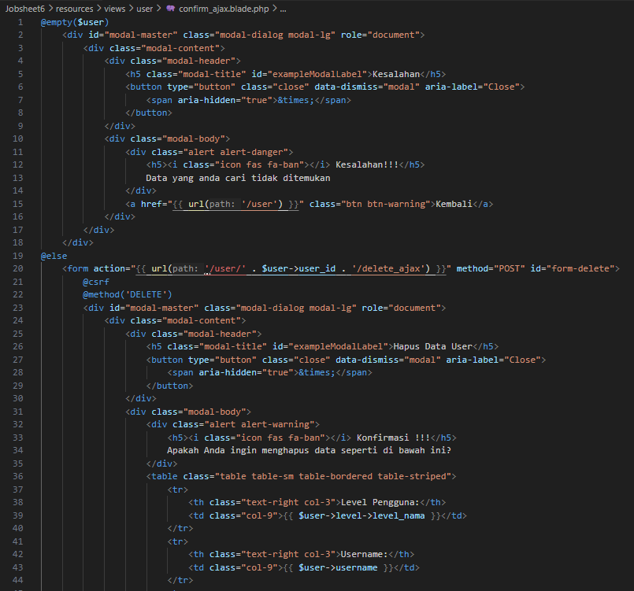

5. Kemudian kita buat fungsi delete_ajax() pada UserController.php untuk
mengakomodir request hapus data user

6. Setelah semua selesai, mari kita coba untuk melakukan percobaan dari koding yang telah
kita lakukan.

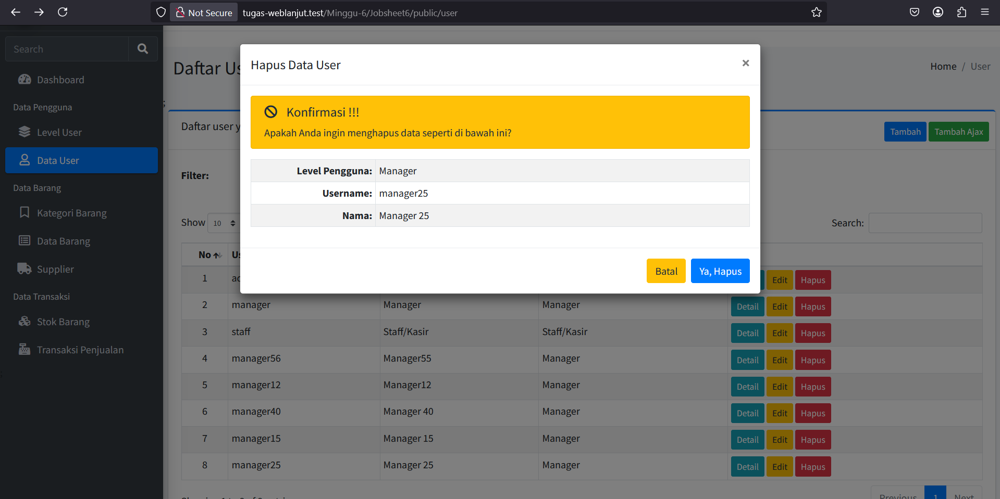

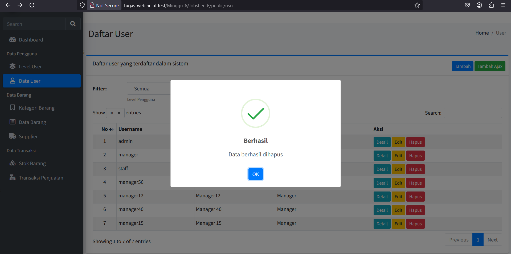

7. Jangan lupa laporkan ke laporan jobsheet dan lakukan commit pada repository git
kalian.!!!