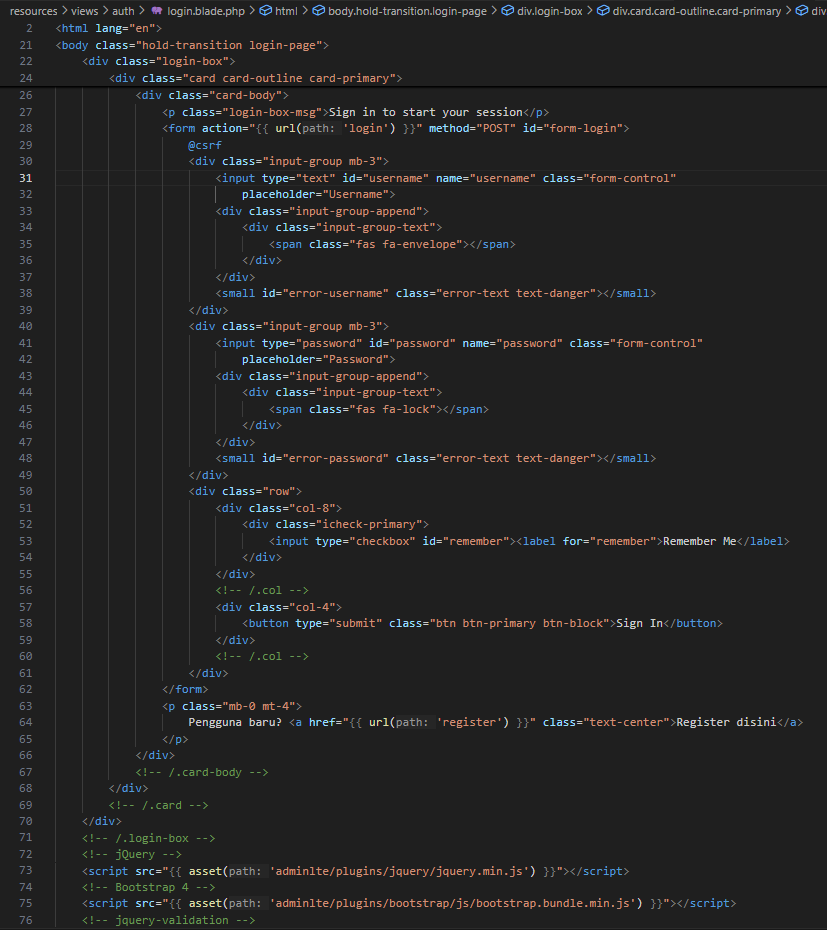
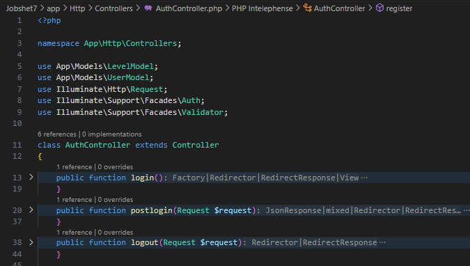

  

<h1 style="text-align: center;">JOBSHEET 07 - 
Authentication dan Authorization di Laravel</h1>

Nama: Achmad Maulana Hamzah

NIM: 2341720172

Kelas: TI 2A

# Praktikum 1 – Implementasi Authentication
1. Kita buka project laravel PWL_POS kita, dan kita modifikasi konfigurasi aplikasi kita di
config/auth.php
Pada bagian ini kita sesuaikan dengan Model untuk tabel m_user yang sudah kita buat

2. Selanjutnya kita modifikasi sedikit pada UserModel.php untuk bisa melakukan proses
otentikasi

3. Selanjutnya kita buat AuthController.php untuk memproses login yang akan kita
lakukan

4. Setelah kita membuat AuthController.php, kita buat view untuk menampilkan halaman
login. View kita buat di auth/login.blade.php , tampilan login bisa kita ambil dari
contoh login di template AdminLTE seperti berikut (pada contoh login ini, kita
gunakan page login-V2 di AdminLTE)

5. Kemudian kita modifikasi route/web.php agar semua route masuk dalam auth

6. Ketika kita coba mengakses halaman localhost/PWL_POS/public makan akan tampil
halaman awal untuk login ke aplikasi

# Tugas 1 – Implementasi Authentication :
1. Silahkan implementasikan proses login pada project kalian masing-masing

2. Silahkan implementasi proses logout pada halaman web yang kalian buat

3. Amati dan jelaskan tiap tahapan yang kalian kerjakan, dan jabarkan dalam laporan

- Mengatur config/auth.php dengan UserModel yang sesuai

- UserModel meng-extends dari “Illuminate\Foundation\Auth\User“

- Membuat AuthController.php untuk memproses login yang memiliki method
login, postLogin, dan logout

- Membuat view/form untuk mengisi informasi login

- Menambahkan rute untuk AuthController pada route/web.php

4. Submit kode untuk impementasi Authentication pada repository github kalian.

# Praktikum 2 – Implementasi Authorizaton di Laravel dengan Middleware
1. Kita modifikasi UserModel.php dengan menambahkan kode berikut

2. Kemudian kita buat middleware dengan nama AuthorizeUser.php. Kita bisa buat
middleware dengan mengetikkan perintah pada terminal/CMD
php artisan make:middleware AuthorizeUser
File middleware akan dibuat di app/Http/Middleware/AuthorizeUser.php
3. Kemudian kita edit middleware AuthorizeUser.php untuk bisa mengecek apakah
pengguna yang mengakses memiliki Level/Role/Group yang sesuai

4. Kita daftarkan ke app/Http/Kernel.php untuk middleware yang kita buat barusan

5. Sekarang kita perhatikan tabel m_level yang menjadi tabel untuk menyimpan
level/group/role dari user ada
6. Untuk mencoba authorization yang telah kita buat, maka perlu kita modiifikasi
route/web.php untuk menentukan route mana saja yang akan diberi hak akses sesuai
dengan level user

Pada kode yang ditandai merah, terdapat authorize:ADM . Kode ADM adalah nilai dari
level_kode pada tabel m_level. Yang artinya, user yang bisa mengakses route untuk
manage data level, adalah user yang memiliki level sebagai Administrator.

7. Untuk membuktikannya, sekarang kita coba login menggunakan akun selain level
administrator, dan kita akses route menu level tersebut

# Tugas 2 – Implementasi Authoriization :

1. Apa yang kalian pahami pada praktikum 2 ini?

Mengimplementasi Authoriization atau hak akses menggunakan middleware

2. Amati dan jelaskan tiap tahapan yang kalian kerjakan, dan jabarkan dalam laporan

- Pada UserModel.php menambahkan method getRoleName dan hasRole

- Membuat dan mengedit middleware AuthorizeUser.php bagaimana menghandle user request dengan mengecheck rolenya

- Mendaftarkan middleware AuthorizeUser.php ke app/Http/Kernel.php

- Pada route/web.php menentukan route mana saja yang akan diberi hak akses 
sesuai dengan levelnya

3. Submit kode untuk impementasi Authorization pada repository github kalian

# Praktikum 3 – Implementasi Multi-Level Authorizaton di Laravel dengan Middleware
1. Kita modifikasi UserModel.php untuk mendapatkan level_kode dari user yang sudah
login. Jadi kita buat fungsi dengan nama getRole()

2. Selanjutnya, Kita modifikasi middleware AuthorizeUser.php dengan kode berikut

3. Setelah itu tinggal kita perbaiki route/web.php sesuaikan dengan role/level yang
diinginkan. Contoh

4. Sekarang kita sudah bisa memberikan hak akses menu/route ke beberapa level user

# Tugas 3 – Implementasi Multi-Level Authorization :
1. Silahkan implementasikan multi-level authorization pada project kalian masing-masing

2. Amati dan jelaskan tiap tahapan yang kalian kerjakan, dan jabarkan dalam laporan

- Pada UserModel.php menambahkan method getRole

- Pada AuthorizeUser.php merubah parameter $roles menajadi array

3. Implementasikan multi-level authorization untuk semua Level/Jenis User dan Menu-
menu yang sesuai dengan Level/Jenis User

4. Submit kode untuk impementasi Authorization pada repository github kalian.

# Tugas 4 – Implementasi Form Registrasi :
1. Silahkan implementasikan form untuk registrasi user.
2. Screenshot hasil yang kalian kerjakan

- Routes:

- Controller: 

- login page:

- register page:

3. Commit dan push hasil tugas kalian ke masing-masing repo github kalian