

  

<h1 style="text-align: center;">JOBSHEET 07 - 
Authentication dan Authorization di Laravel</h1>

Nama: Achmad Maulana Hamzah

NIM: 2341720172

Kelas: TI 2A

# Praktikum 1 – Implementasi Upload File untuk import data
1. Kita buka database yang sudah kita buat sebelumnya, dan kita cek tabel m_kategori dan
m_barang

<b>m_kategori:</b>

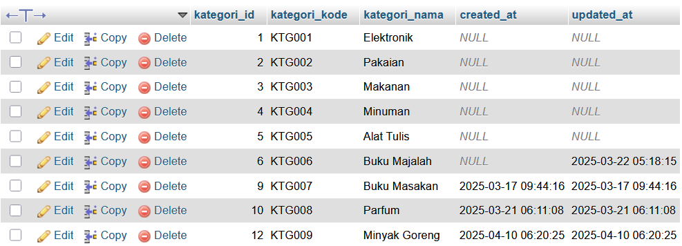

<b>m_barang:</b>

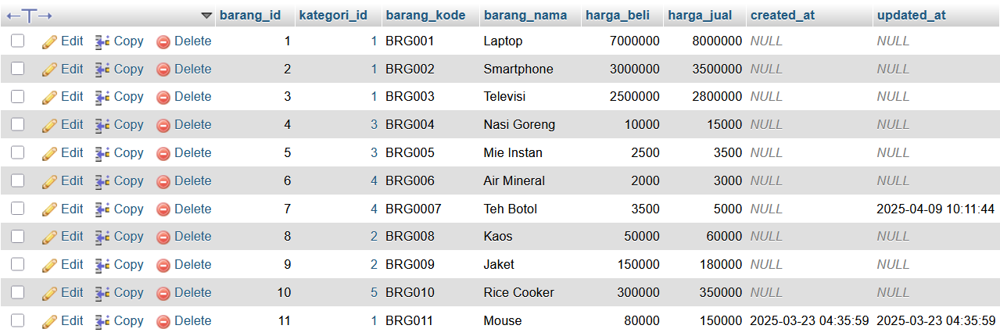

2. Disini kita akan mencoba untuk memasukkan data ke dalam sistem kita secara banyak.
Kita bisa menggunakan file excel untuk mencoba memasukkan data barang ke dalam
sistem kita. Kita buat template file excel yang akan kita gunakan untuk import data
barang. Contoh kita ingin mengimport 5 data barang sekaligus. Kita simpan ke file excel dengan
nama template_barang.xlsx, dan kita simpan pada folder public di project web kita.

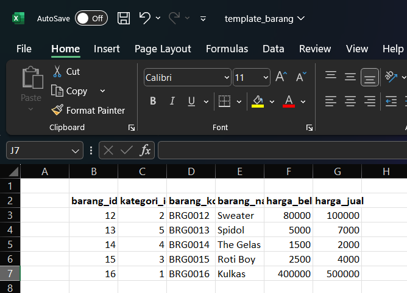

3. Selanjutnya kita modifikasi view pada barang/index.blade.php untuk bisa
menambahkan tombol menambah form untuk upload untuk import data barang

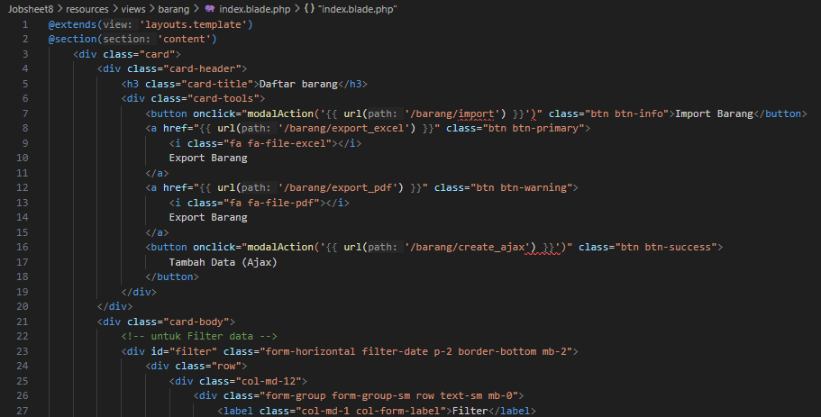

4. Selanjutnya kita buat view untuk form upload/import file excel dan download file
template_barang.xlsx. Kita beri nama file dengan nama barang/import.blade.php

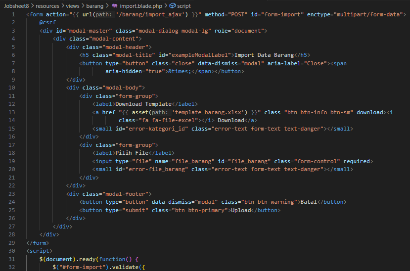

5. Kemudian kita modifikasi route/web.php untuk mengakomodir proses upload file pada
menu barang

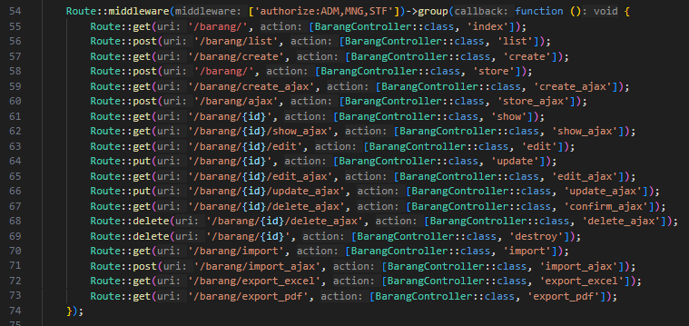

6. Untuk bisa membaca/menulis file excel, maka kita butuhkan library untuk
membaca/menulis file excel. Jadi kita bisa memakai library phpoffice/phpspreadsheet.
Kita ketikkan perintah di terminal/CMD

composer require phpoffice/phpspreadsheet

7. Selanjutnya kita modifikasi file BarangController.php untuk memproses data

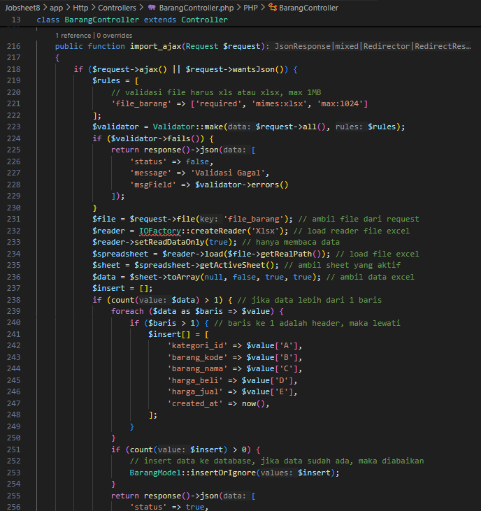

8. Sekarang kita coba jalankan browser dan klik tombol import pada menu Barang

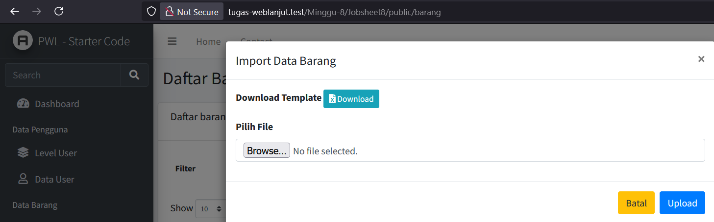

9. Kita upload template data yang sudah kita siapkan, dan amati apa yang terjadi.

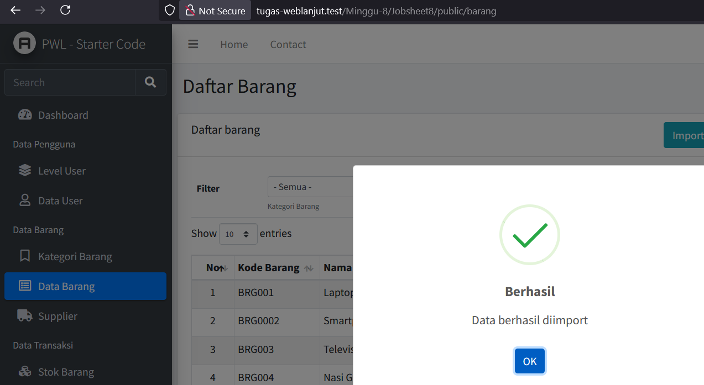

# Tugas 1 – Implementasi File Upload untuk Import Data:
1. Silahkan implementasikan praktikum 1 pada project kalian masing-masing untuk semua
menu
2. Amati dan jelaskan tiap tahapan yang kalian kerjakan, dan jabarkan dalam laporan
3. Submit kode untuk impementasi prakktikum 1 pada repository github kalian.

# Praktikum 2 – Export Data ke Excel
1. Kita modifikasi barang/index.blade.php dengan mengganti kode berikut
Kita ubah dengan
Hal ini kita lakukan karena tombol Tambah Data sudah tidak kita gunakan karena kita
sudah menggunakan tombol Tambah Data (Ajax).

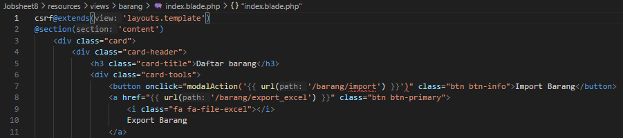

2. Kemudian kita tambahkan route pada route/web.php untuk bisa memproses export excel

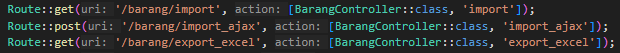

3. Selanjutnya kita tambahkan fungsi export_excel() pada file BarangController.php
4. Kita ambil data barang yang akan kita export ke excel (tentu dengan menyertakan relasi
kategori barang)
5. Kemudian kita load library Spreadsheet dan kita tentukan header data pada baris
pertama di excel
6. Selanjutnya, kita looping data yang telah kita dapatkan dari database, kemudian kita
masukkan ke dalam cell excel
7. Kita set lebar tiap kolom di excel untuk menyesuaikan dengan panjang karakter pada
masing-masing kolom
8. Bagian akhir proses export excel adalah kita set nama sheet, dan proses untuk dapat di
download oleh pengguna

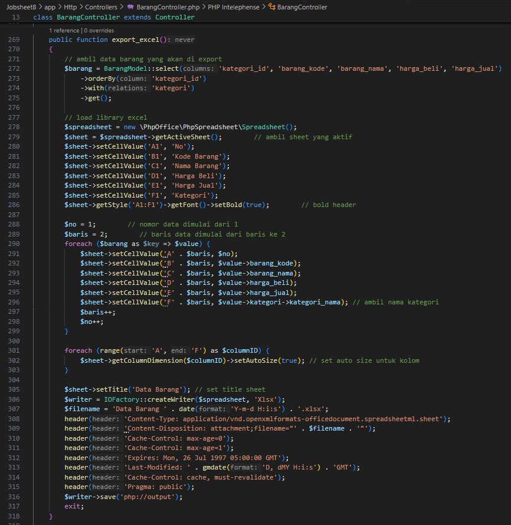

9. Jika sudah selesai diimplementasikan, kita coba untuk melakukan Download file Export
tersebut.

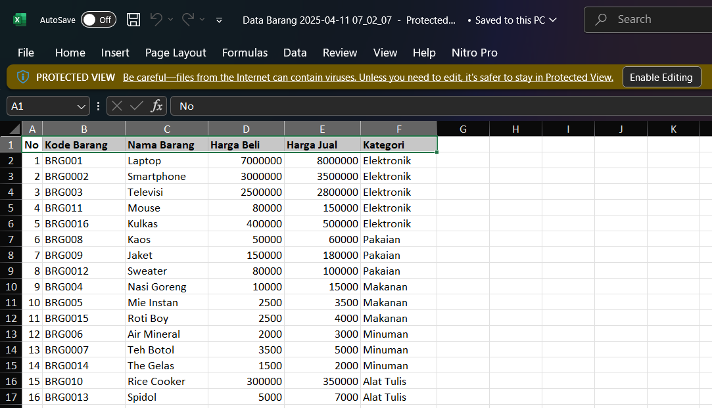

# Tugas 2 – Implementasi File Export Excel:
1. Silahkan implementasikan praktikum 2 pada project kalian masing-masing untuk semua
menu
2. Amati dan jelaskan tiap tahapan yang kalian kerjakan, dan jabarkan dalam laporan
3. Submit kode untuk impementasi prakktikum 2 pada repository github kalian.

# Praktikum 3 – Implementasi Export PDF di Laravel dengan dompdf
1. Kita lakukan proses instalasi library dompdf terlebih dahulu dengan mengetikkan
perintah pada terminal/CMD
composer require barryvdh/laravel-dompdf
2. Setelah proses instalasi dompdf berhasil, selanjutnya Kita tambahkan kode berikut untuk
menambahkan tombol export ke pdf pada barang/index.blade.php

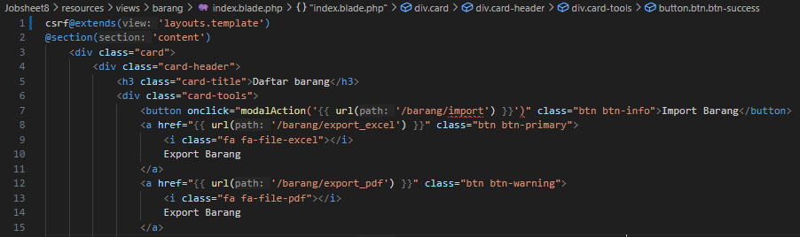

3. Setelah itu tinggal kita perbaiki route/web.php untuk proses export pdf

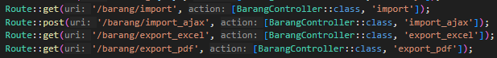

4. Selanjutnya, kita buat fungsi export_pdf() pada BarangController.php

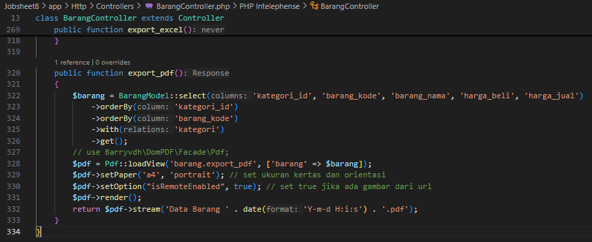

5. Selanjutnya, kita buat view untuk dijadikan pdf dari layout html. File bisa kita buat
dengan nama barang/export_pdf.blade.php
6. Selanjutnya kita buat view untuk me-generate html untuk tampilan pdf yang akan kita
sajikan. View berada di barang/export_pdf.blade.php
7. Selanjutnya, Kita coba untuk melakukan proses download export pdf. Amati dan
pelajari…!!!

# Tugas 3 – Implementasi Export PDF pada Laravel :
1. Silahkan implementasikan export pdf pada project kalian masing-masing untuk semua
menu
2. Amati dan jelaskan tiap tahapan yang kalian kerjakan, dan jabarkan dalam laporan
3. Submit kode untuk impementasi export pdf pada repository github kalian.